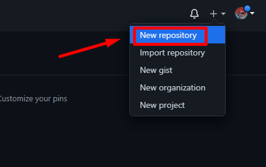
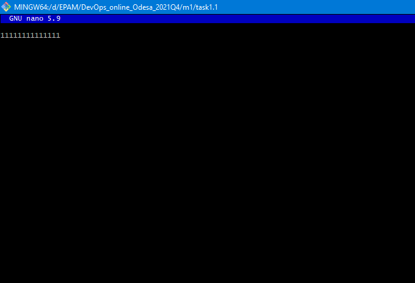
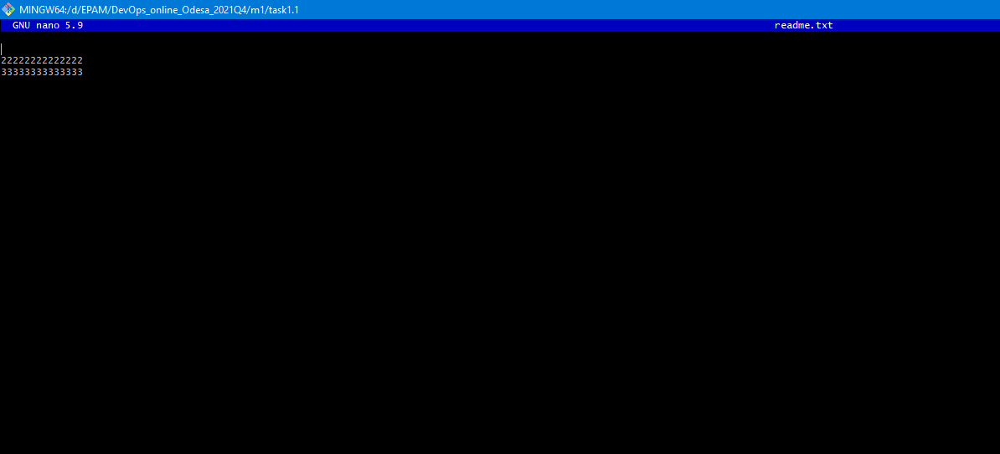
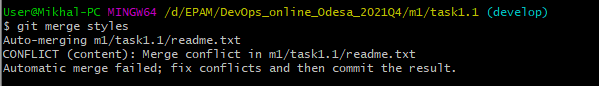
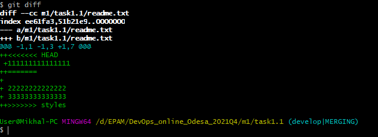
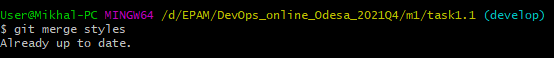

# My first task in the EPAM (Task  1.1)

1) I download Git for Windows from official repository - https://github.com/git-for-windows/git/releases/download/v2.33.1.windows.1/Git-2.33.1-64-bit.exe

2) So, than I installed Git.
For set up Username and email I use next commands:
```
git config --global user.name "kiykomi"
git config --global user.email "kiykomi@gmail.com"
```
Core text editors like nano  and vi\vim has been installed with git bash shell (emulation of bash for Windows).

3) I already  have account on githab - kiykomi@gmail.

4) I created private repo (this is a wery simple stage and stages like this I will not describe in this tutorial).



5) I cloned my repo to mu workstation (I know, this is must be a trouble with SSH and I had to create ssh key pair for git and github, but all worked without this procedure. This procedure I proceed after main task).
```
git clone https://github.com/kiykomi/DevOps_online_Odesa_2021Q4.git
```

6) OK, my project located on windows directory D:\EPAM\DevOps_online_Odesa_2021Q4. I go to the project main directory with command:
```
cd /d/EPAM/DevOps_online_Odesa_2021Q4
```

7) I create folder tree in my local repo and check result with command:
```
mkdir m1/task1.1 m1/task1.2 m2/task2.1 m2/task2.2 .... etc...
ls -R | grep ":$" | sed -e 's/:$//' -e 's/[^-][^\/]*\//--/g' -e 's/^/   /' -e 's/-/|/'
git add .
git status
git commit -m "add repositiry file-structure"
cd m1/task1.1/

```

8) Not need to be commented.

9) I created this file with command:
```
touch readme.txt
```

10) I make init and commit with next commands:
```
Git init
git add .
git commit -m "My first commit - add a readme.txt file"
```

11) I created develop branch with command:
```
git checkout -B develop
```
Why I use this command? Because this is short way, else I must be use next commands:
```
git branch develop
git checkout develop
```

12) Created index.html with command:
```
touch index.html
git add index.html
git commit -m "Added empty index.html file"
```

13) 
```
git checkout -B images
mkdir images
git add .
git commit -m "added images folder and images of samurai warriors"
```

14) 
```
nano index.html
git add .
git commit -m "added links to the images of Samurai warriors to index.html file"
```
Created simple html file with photos of Samurai and simple text:
```
<!DOCTYPE HTML>
<html>
 <head>
  <title>Samurai Warriors</title>
 </head>
 <body>
  <h3 align="center">Images and photos of famous Japan Samurai warriors</h3>
  <div align="center">
   
   <p>Samurai and sunrise</p>
  </div>
  <div align="center">
   
   <p>Samurai</p>
  </div>
  <div align="center">
   
   <p>Lonely Warrior</p>
  </div>
  <div align="center">
   
   <p>Famous Samurai<p/>
  <div/>
 </body>
</html>
```


15) Go to develop branch:
```
git checkout develop
```

16) So, lets create some styles for our web-page:
```
git checkout -B styles
mkdir styles
nano styles/styles.css
```
I want font LucidaConsole and width of 40%

```
h2 {
  font-family: Lucida Console;
  
}
img {
  width: 40%; 
}
```

17) In this step I go with easy way, because this is not denided in task, but ib the end of task I understud, that this step should have caused an error of merge and try simulate this.
But now I choose easy way:
```
git checkout images
nano index.html
git add .
git commit -m "added to CSS file on a styles folder"
```
I add in file line:
```
<link rel="stylesheet" href="styles/styles.css">
```

18) 
```
git checkout develop
git branch
```

After any changes i check my branches and sometime check  status of Git.


19) I merged branches, like note in task (Understud, this should have caused an error, but I tricked the system:) )
```
 git checkout develop
git branch
git merge  images
git branch
ls
git merge styles
ls
``` 
Why I wrote LS command? Because I want to check, have  I see files from another (merged) branches.


20) no comments

21) 
```
git checkout main
git merge develop
```

22) I inspect my repository after merge branches in three ways:
```
git log 
git diff
git log --merge
```
1 - can see all log
2 - can see differents and conflicts before merge
3 - list of commit conflicts after merge

23) So, lets push our project to GitHub!
```
git push origin --all
```
Its really easy!!!


24) 
```
git reflog
```
in this step I have a mistake - true command must be like "git reflog > /j/dnd/task1.1_GIT.txt"

Output:
```
6a64426 (HEAD -> main, origin/main, origin/develop, develop) HEAD@{0}: merge develop: Fast-forward
cbe2588 HEAD@{1}: checkout: moving from develop to main
6a64426 (HEAD -> main, origin/main, origin/develop, develop) HEAD@{2}: merge styles: Merge made by the 'recursive' strategy.
cbe2588 HEAD@{3}: checkout: moving from styles to develop
09b78ac (origin/styles, styles) HEAD@{4}: commit: fixed merge bug on index.html
70f87d4 HEAD@{5}: checkout: moving from develop to styles
cbe2588 HEAD@{6}: reset: moving to HEAD
cbe2588 HEAD@{7}: reset: moving to HEAD
cbe2588 HEAD@{8}: checkout: moving from styles to develop
70f87d4 HEAD@{9}: commit: add new word (family) to index html
d5fe290 HEAD@{10}: checkout: moving from main to styles
cbe2588 HEAD@{11}: checkout: moving from styles to main
d5fe290 HEAD@{12}: checkout: moving from main to styles
cbe2588 HEAD@{13}: merge develop: Fast-forward
8b72646 HEAD@{14}: checkout: moving from develop to main
cbe2588 HEAD@{15}: merge styles: Merge made by the 'recursive' strategy.
34a26ee (origin/images, images) HEAD@{16}: merge images: Fast-forward
aba8d7e HEAD@{17}: checkout: moving from images to develop
34a26ee (origin/images, images) HEAD@{18}: commit: added to CSS file on a styles folder
2cefd20 HEAD@{19}: checkout: moving from styles to images
d5fe290 HEAD@{20}: commit: added folder styles contains CSS file styles.css
aba8d7e HEAD@{21}: checkout: moving from develop to styles
aba8d7e HEAD@{22}: checkout: moving from images to develop
2cefd20 HEAD@{23}: commit: added links to the images of Samurai warriors to index.html file
dd6cbff HEAD@{24}: commit: added images folder and images of samurai warriors
aba8d7e HEAD@{25}: checkout: moving from develop to images
aba8d7e HEAD@{26}: commit: Added empty index.html file
8b72646 HEAD@{27}: checkout: moving from main to develop
8b72646 HEAD@{28}: commit (initial): My first commit - add a readme.txt file
```

25)

```
cp /j/dnd/task1.1_GIT.txt.txt /d/epam/DevOps_online_Odesa_2021Q4/m1/task1.1/task1.1_GIT.txt
git add /d/EPAM/DevOps_online_Odesa_2021Q4/m1/task1.1/task1.1_GIT.txt
git commit -m "added task1.1_GIT.txt file"
git push
```


## So, lets make conflict in files and see  what happens:
* I go to the styles  branch and change readme file in two branches and merge those with develop.
* Go  to the branch Images and change readme.txt



* Go  to the branch Styles and change readme.txt 




* When we merge branchs  we have a conflict!



* Lats see, what happend?



* Terminate merge process with command 
```
git merge --abort 

```

* Edit our file and try to merge again



* Oh my God! Its really work)))


# What is DevOps?
## In my humble opinion, DevOps - is a method of team work, that is designed to optimize development process and automation of routine  tasks, who excluded human mistakes and and rationalizing time resources.


