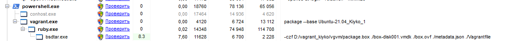

# Task 2.1


## Part 1.

### Most popular Hypervisors 1st type
1) VMWare Vsphere or free version - ESXi.
2) Microsoft Hyper-V.
3) QEMU/KVM  (proxmox used KVM  technology).
4) Xen Citrix.

### But we have some emulators and Hypervisors 2nd type:
1) Microsoft VirtualPC.
2) VMWare Workstation.
3) Oracle VirtualBox.
4) QEMU emulator (for simple testing  boot images).
5) OpenVZ


## Differents of Hypervisors

* First different is a type of hypervisor.
Hypervisors of type 1 works with computer "metal" natively and dont need to be installed other OS, so to speak "Bare Metal", they are have more better performance then hypervisors of 2nd type, who work over installed OS like Windows, MacOS or Linux and working slower, but sometimes, it is the only solution for quick test software and OS before deploy it in  production.

* Lets look on differents of most popular HV:
- VMWare Vsphere - this is a first popular hypervisor, works with all server platforms, has in its composition a kernel similar to Linux, but with  own CLI commands and utilites, have a free versions (ESXi).

- MS Hyper-V - works only on Windows Server,  like a part of this OS, usually used with Windows virtualization, unlike the previous HV, Hyper-V do not have a USB mapping to VM and not have a free  versions (you must have a license for Windows and for Hyper-V). 

- KVM - it is opensorce solution for virtualization. Have a many functions and futures, but it is new product in virtualization arena and have some bugs in his work (not recommended to use in high-load projects). KVM - only command line, but he have a many GUI shells. It is solution for professionals, who know what thay doing.


## Part2.

*  My knoweledge and expirience in Virtual Box is not bad, but I never used Virtual Box in CLI mode. So, let's fix this sad omission!

- First step - let's create VM, SATA controlle, HDD and DVD with Ubuntu image, configure parameters and network, and start her.

```
VBoxManage createvm --name Ubuntu-21.04_Kiyko --ostype Ubuntu_64 --register --basefolder d:/VM

VBoxManage modifyvm Ubuntu-21.04_Kiyko --cpus 2 --memory 2048 --vram 256 --nic1 bridged --bridgeadapter1 eth0 

VBoxManage storagectl Ubuntu-21.04_Kiyko --name "SATA Controller" --add sata --bootable on

VBoxManage createmedium disk --filename D:\VM\Ubuntu-21.04_Kiyko\ubuntu_disk1.vdi --size 12288 --format VDI --variant Standard

VBoxManage storageattach Ubuntu-21.04_Kiyko --storagectl "SATA Controller" --port 0 --device 0 --type hdd --medium D:\VM\Ubuntu-21.04_Kiyko\ubuntu_disk1.vdi 

VBoxManage storageattach Ubuntu-21.04_Kiyko --storagectl "SATA Controller" --port 1 --device 0 --type dvddrive --medium J:/dnd/ubuntu-21.10-desktop-amd64.iso

VBoxManage startvm Ubuntu-21.04_Kiyko
```

- Not bad! Let's try to manipulate with VM state in CLI and look to our results.

```
VBoxManage startvm Ubuntu-21.04_Kiyko

VBoxManage controlvm Ubuntu-21.04_Kiyko pause

VBoxManage controlvm Ubuntu-21.04_Kiyko resume

VBoxManage controlvm Ubuntu-21.04_Kiyko reset

VBoxManage controlvm Ubuntu-21.04_Kiyko savestate

VBoxManage startvm Ubuntu-21.04_Kiyko

VBoxManage controlvm Ubuntu-21.04_Kiyko poweroff

VBoxManage controlvm Ubuntu-21.04_Kiyko clipboard mode bidirectional

VBoxManage controlvm Ubuntu-21.04_Kiyko draganddrop bidirectional

```


- Awersome! I can control my VM from CLI and automate they things in future.

- Let's try to clone VM, export-import, use USB mapping and SharedFolder mapping.


```
VBoxManage clonevm Ubuntu-21.04_Kiyko --basefolder=D:\VM --mode=machine --name=VM2 --register 

VBoxManage modifyvm Ubuntu-21.04_Kiyko --name Ubuntu-21.04_Kiyko_1

VBoxManage modifyvm VM2 --name Ubuntu-21.04_Kiyko_2

VBoxManage modifyvm Ubuntu-21.04_Kiyko_1 --groups "/MyFirstGroup"

VBoxManage modifyvm Ubuntu-21.04_Kiyko_2 --groups "/MyFirstGroup"

VBoxManage snapshot Ubuntu-21.04_Kiyko_1 take snapshot-2021-11-06_19-31 

VBoxManage snapshot Ubuntu-21.04_Kiyko_1 take snapshot-2021-11-06_19-44

VBoxManage export Ubuntu-21.04_Kiyko_1 -o d:\vm\Ubuntu-21.04_Kiyko_1.ova

VBoxManage import d:\vm\Ubuntu-21.04_Kiyko_1.ova
```


hmmm, usb mapping has been finished with BSOD (have  some incopatibles with my hardware).

OK, let's try to connect shared folder to VM. Previously we must install vbox additions with command  on VM:


```
sudo apt-get install virtualbox-guest-additions-iso
```

And connect a shared folder:

```
VBoxManage sharedfolder add Ubuntu-21.04_Kiyko_1 --name=SFolder --hostpath=J:\dnd --automount --auto-mount-point=SFolder

mkdir /home/kiykomi/vboxshare

sudo mount -t vboxsf -o uid=1000,gid=1000 SFolder /home/kiykomi/vboxshare
```


-  Wonderful! I can share some files with my VM! So, what about change of network configuration?

```
VBoxManage modifyvm Ubuntu-21.04_Kiyko_1 --nic1 nat
```

- Let's check the network connection parameters before and after:


- Check ping to host 8.8.8.8:


- All is works!


# Part 3.

## Now, I see how make a vagrant VM automatically. 


### Let's make VM from our own .box file:

```
mkdir vgvm

cd .\vgvm

vagrant package --base Ubuntu-21.04_Kiyko_1

vagrant box add Ubuntu-21.04_Kiyko_3 package.box

vagrant init Ubuntu-21.04_Kiyko_3

vagrant up
```


### As we can see - Vagrant use in his work standart vbox cli commands...





# Used information sourced:

https://www.xelent.ru/blog/sravnenie-gipervizorov-kvm-hyper-v-ili-vmware/

https://www.oracle.com/technical-resources/articles/it-infrastructure/admin-manage-vbox-cli.html

Also, I use rules of markdown for create previous and this readme.md - https://github.com/DavidAnson/markdownlint/blob/v0.24.0/doc/Rules.md

https://www.virtualbox.org/manual/UserManual.html

https://medium.com/@gajbhiyedeepanshu/building-custom-vagrant-box-e6a846b6baca


# P.S. 

Oh, if you knew, how many mistakes I have in my home-task process, but I do not display they in this report, becouse he mey be unreadeble after it)))

