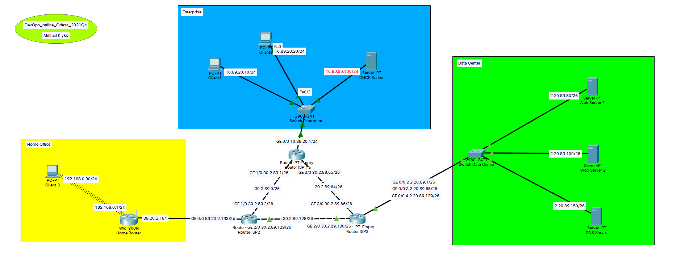
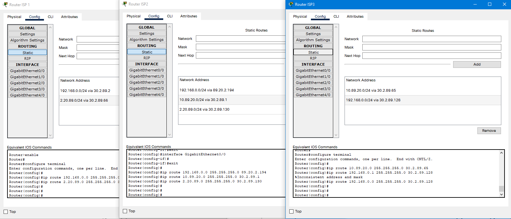
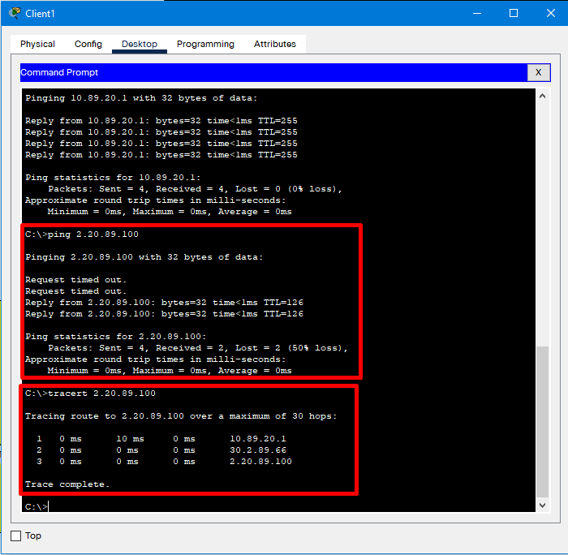
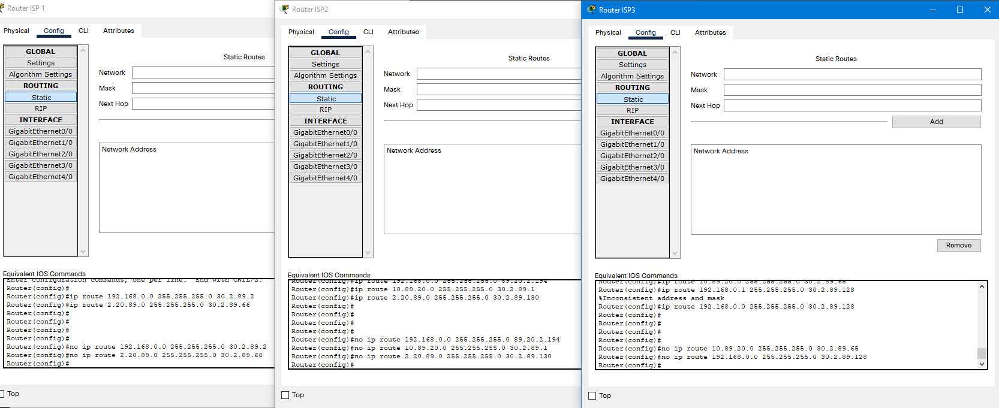
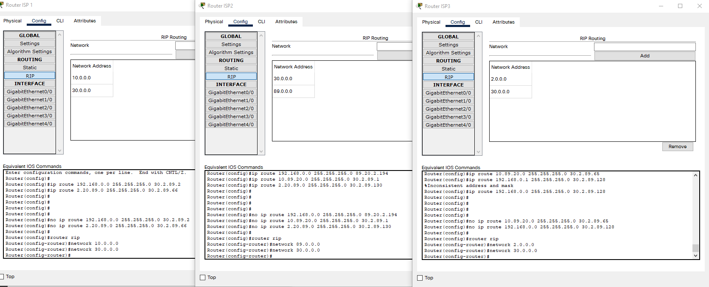
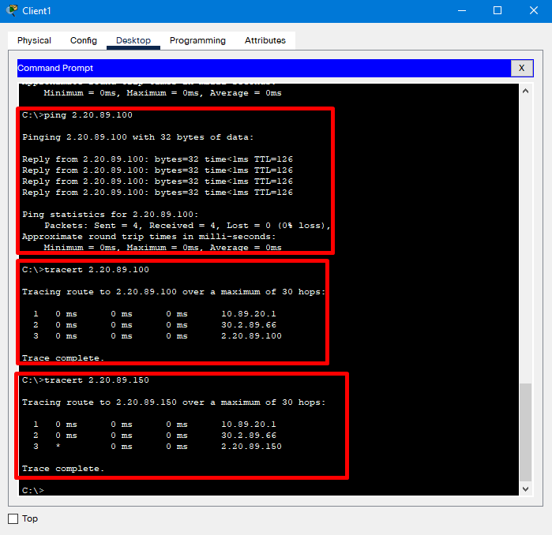

# Task 3.3.

## So, let's see to my current network organisation.

## Setting up static routes

## Checking connection from Client 1 to Web Server 2.

## Clearing static routes

## Setting up RIP routing (adding connected networks prefix in format xxx.0.0.0)

## Testing connection from Client 1 to Web Server 2.

