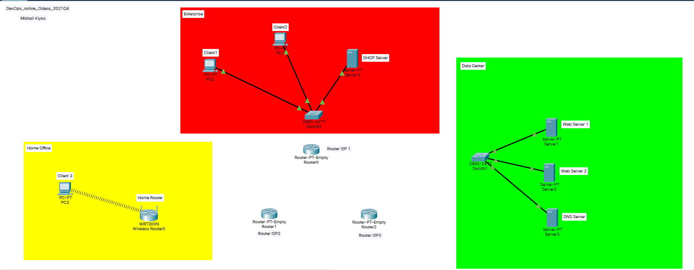
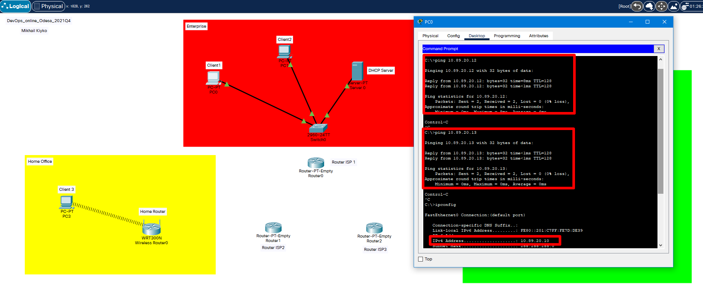
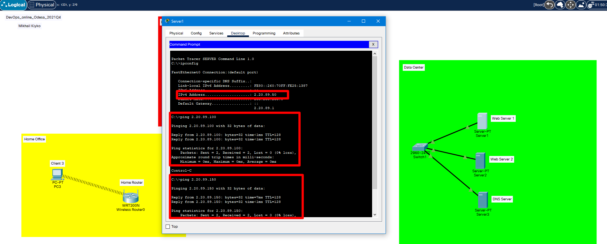
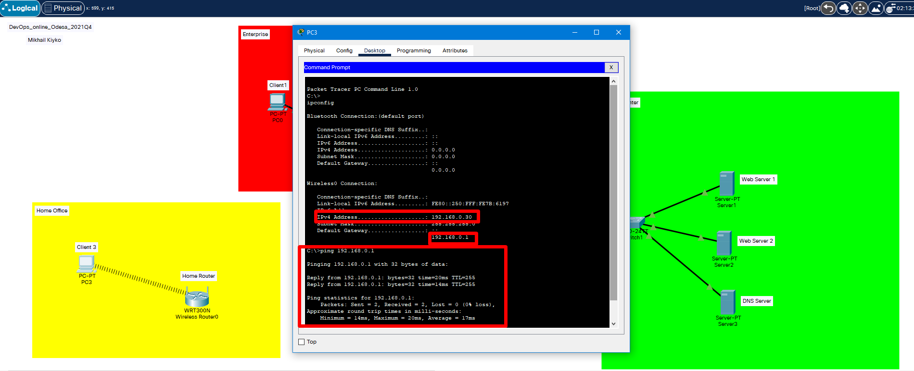

# Task  3.1.

## Creating device map with arrange devices on locations "Home Office", "Data Center" and "Enterprise".

## Set network settings for Enterprise network devices.

## Set network settings for Data Center network devices.

## Set network settings for Home Office network devices.

## Result of Additional task for Task 3.1.

