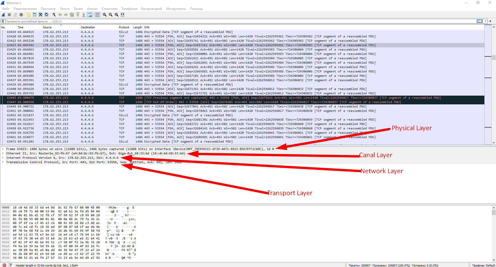
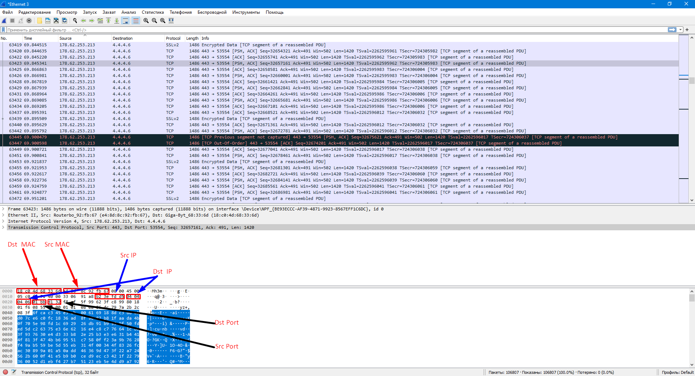

# Task  3.1.

## Creating device map with arrange devices on locations "Home Office", "Data Center" and "Enterprise".

## Set network settings for Enterprise network devices.

## Set network settings for Data Center network devices.

## Set network settings for Home Office network devices.

## Result of Additional task for Task 3.1.

Sender MAC-address: e4:8d:8c:92:fb:67
Sender IP-address: 178.62.253.213
Sender Port: 443

Reciever MAC-address: 18:c0:4d:68:33:6d
Reciever IP-address: 4.4.4.6
Reciever Port: 53554

