# Task 3.2.


## Let's make a network config with routers.

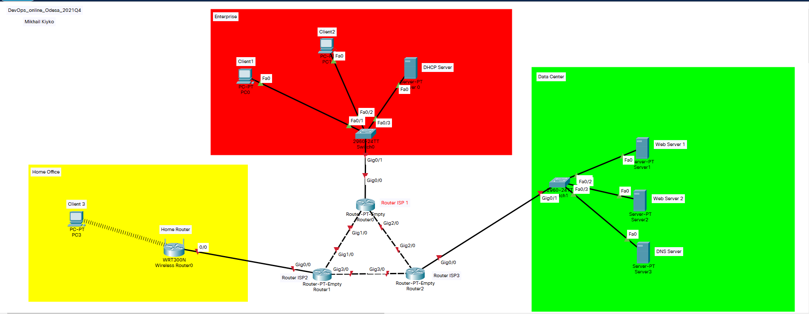


## Let's check ping from  devices to routers.

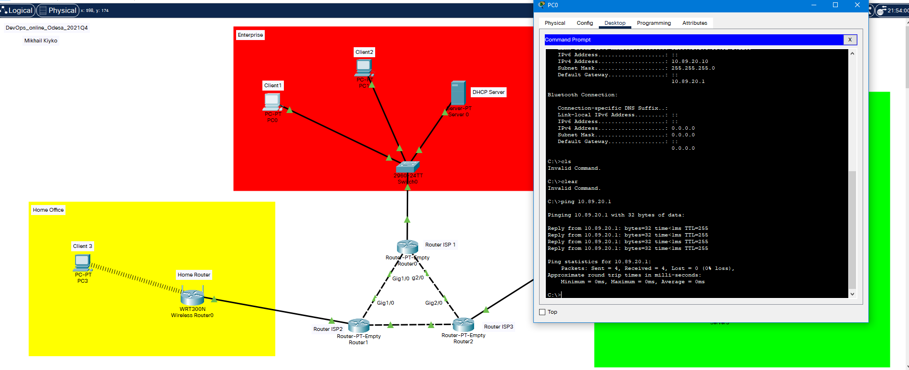


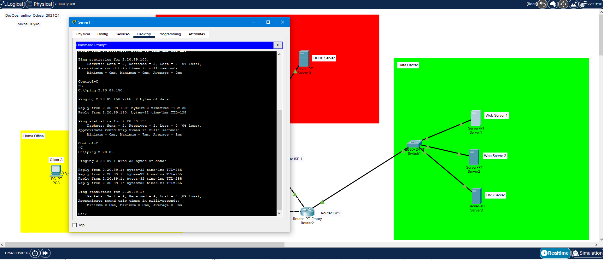


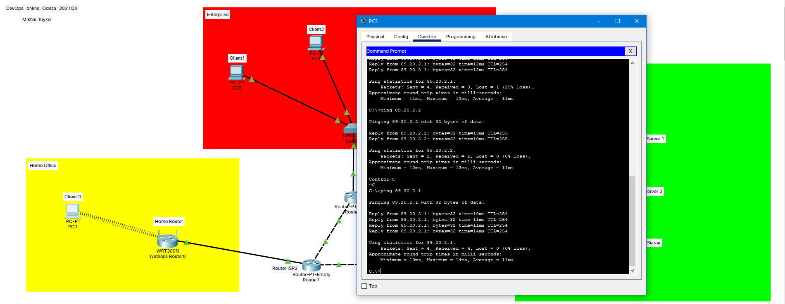


## Let's do a ping and traceroute  command befor changes in Data Center network.

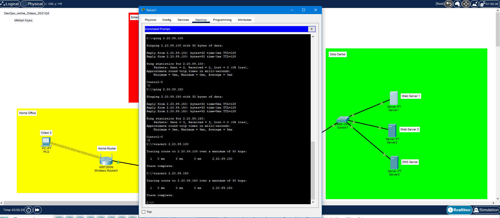


## Let's change netmask to /26 (255.255.255.192)

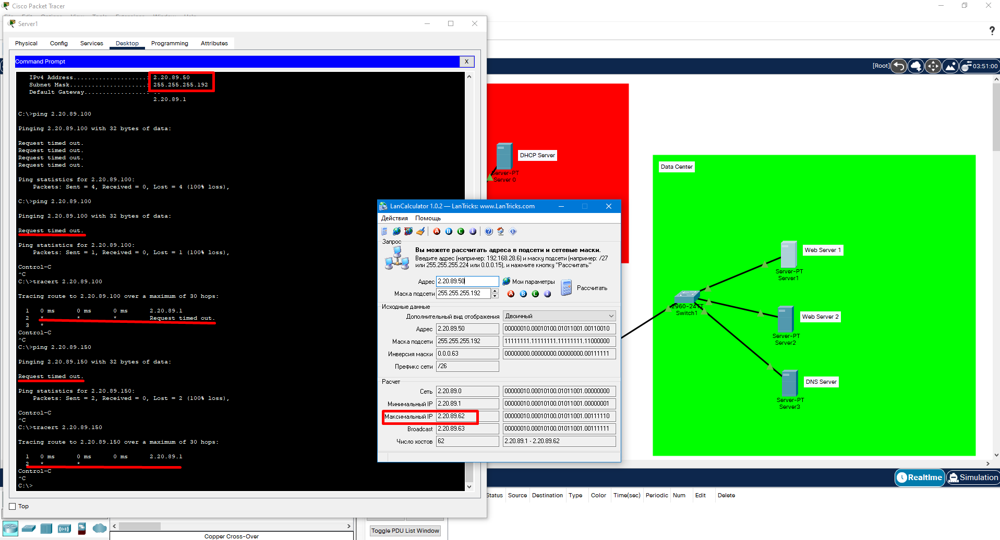

### As we are see, ping and traceroute success on 2.20.89.1 (router), but unsuccessful on endpoint devices. This trouble persist, because network with mask 26 include only 62 hosts, but our servers have addresses 50, 100 and 150. 100 and 150 - out of limits, of the network.

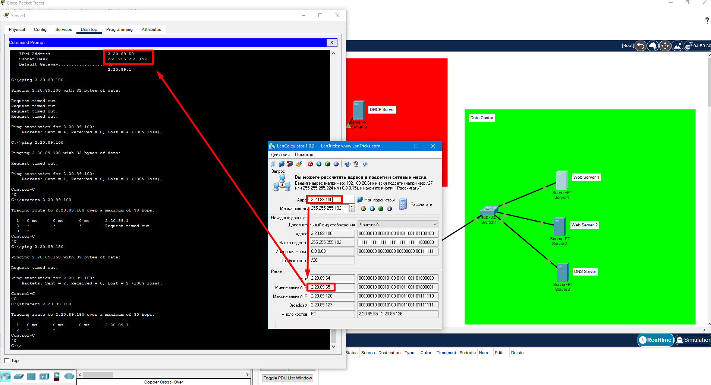


## Let's make 4 VLAN on switch in Data Center and assign it with ports  GE0/1 - GE0/3.

### As we are see, Ping and Traceroute do not working, because now devices  living in another virtual networks and not configured trunk port in router ISP3.

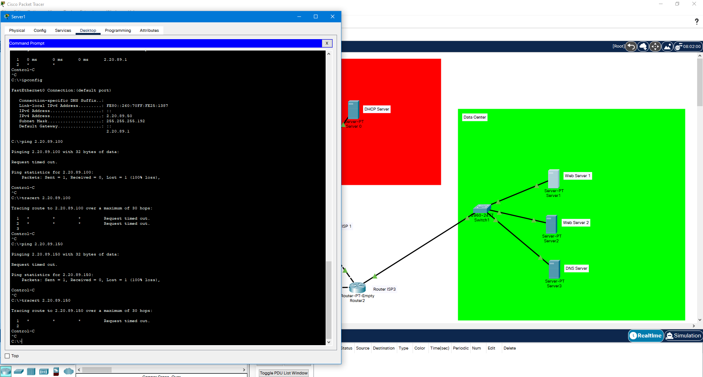


## Let's change port FE0/1 state to trunk on a switch Data Center, make virtual interfaces on router ISP3 and set new ip addresses, corresponding servers subnets and addresses.

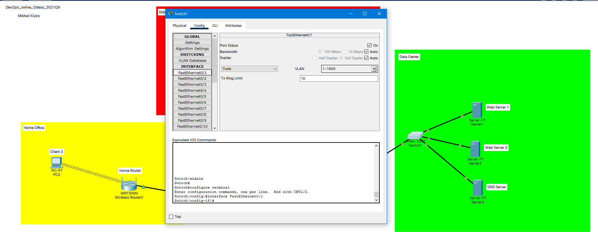


```
interface GigabitEthernet0/0.2
encapsulation dot1Q 2
ip address 2.20.89.1 255.255.255.192
interface GigabitEthernet0/0.3
encapsulation dot1Q 3
ip address 2.20.89.65 255.255.255.192
interface GigabitEthernet0/0.4
encapsulation dot1Q 4
ip address 2.20.89.129 255.255.255.192
```

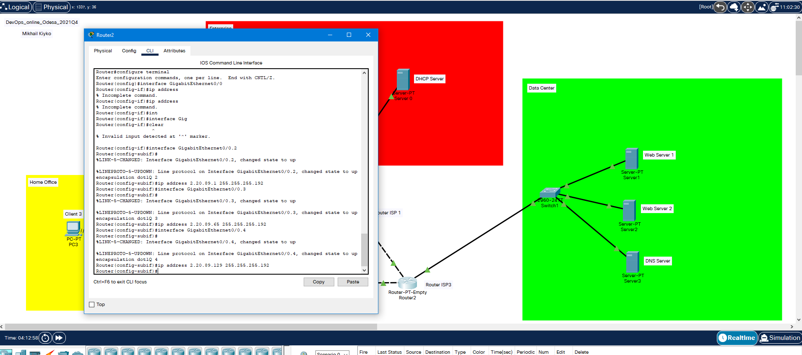

## Setting Default Gateway for servers according with new addresses.

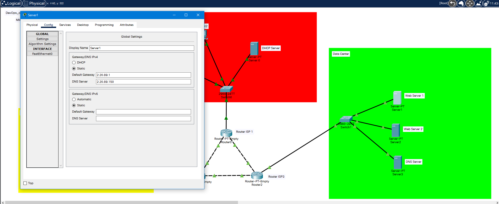


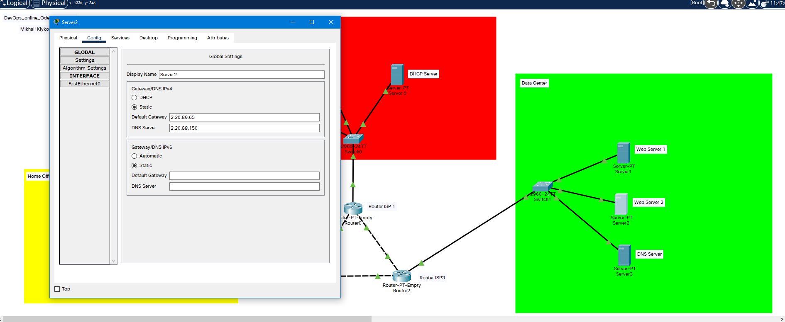


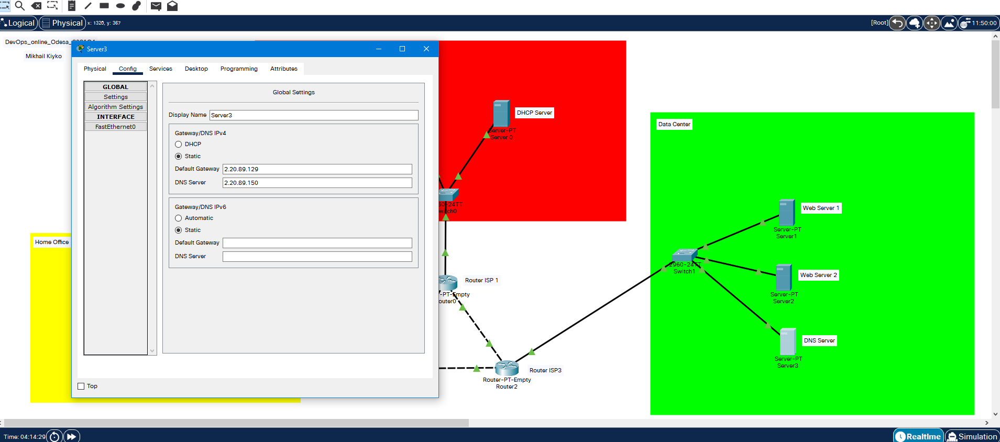

## Let's  ping our server now, when VLAN is configured correctly.

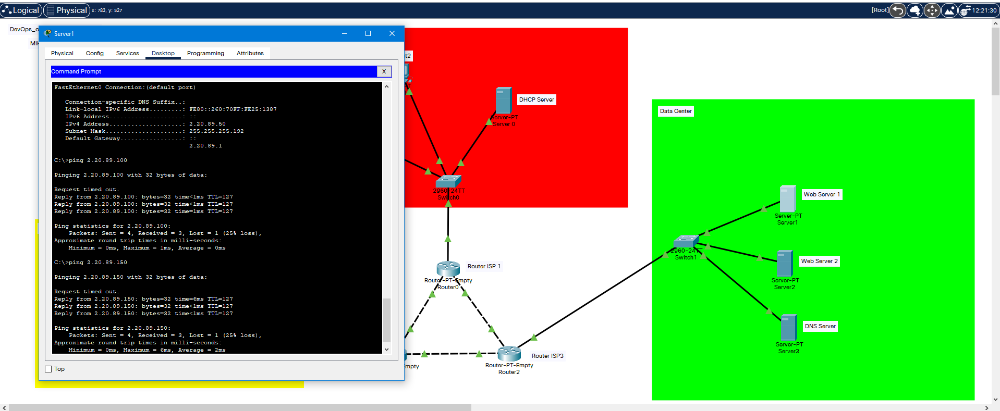


## Address Table

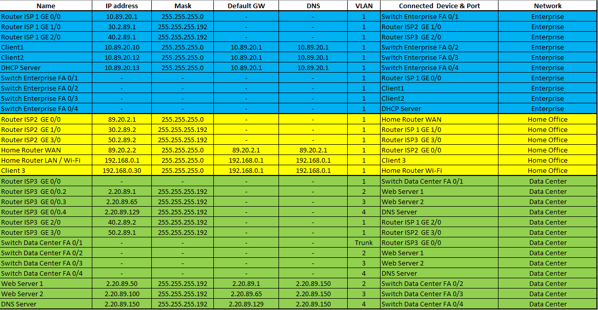


