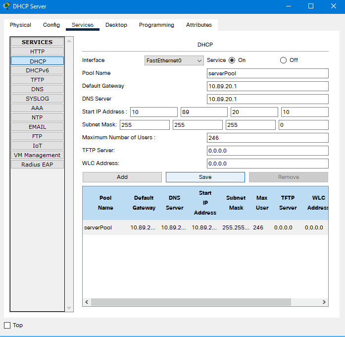
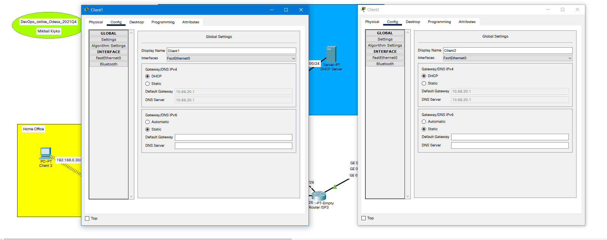
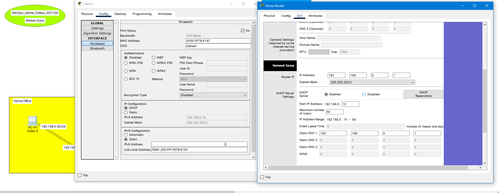
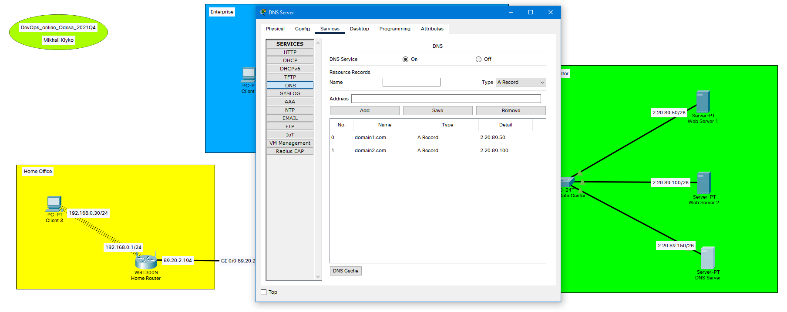
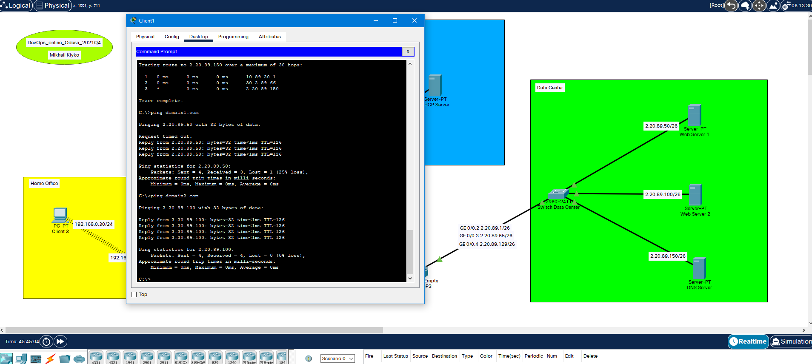
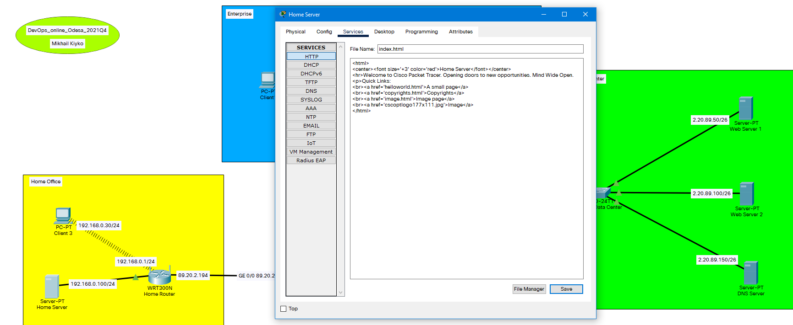
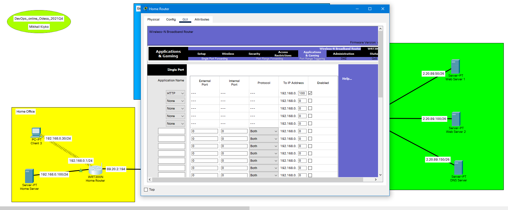
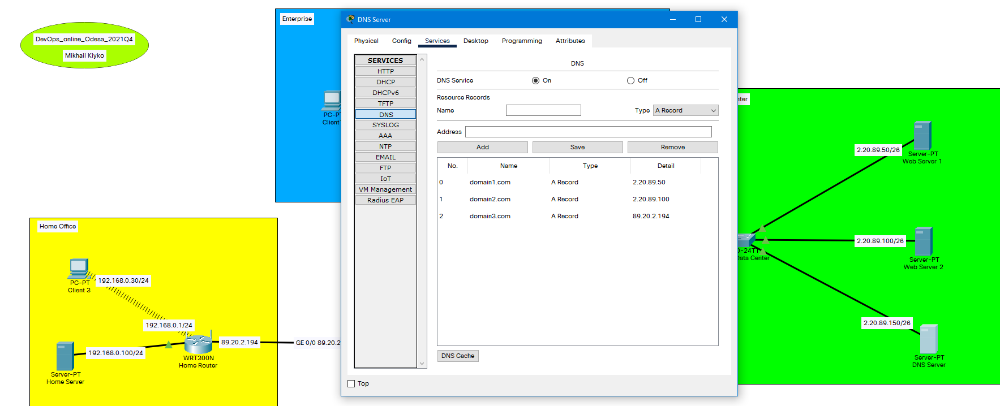
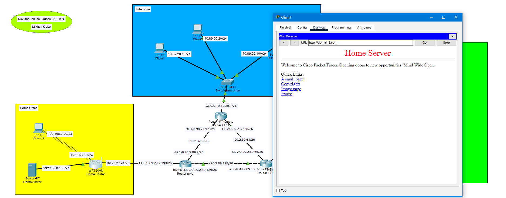

# Task 3.4.

## Setting up DHCP server.

## Checking work of DHCP server on clients 1 and 2.

## Setting up DHCP on Home Router and checking client 3 to get address from router's DHCP.

## Setting up DNS service on DNS server.

## Checking work of DNS Server.

## Adding a new server with name "Home Server", setting up HTTP service.

## Setting up Port Forwarding on Home Router.

## Adding DNS record for domain3.com (Home Server) on DNS Server.

## Checking work of DNS Server from Client 1 in web-browser.

