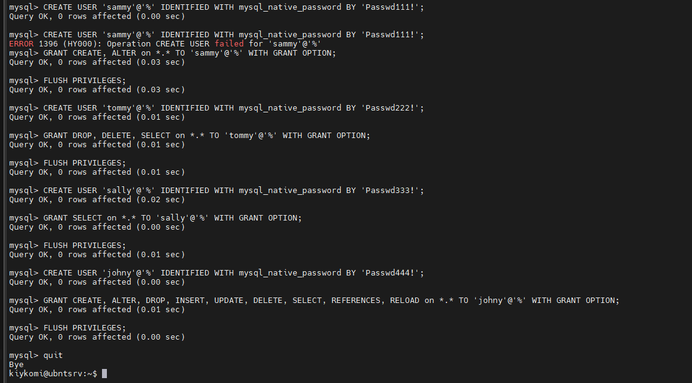
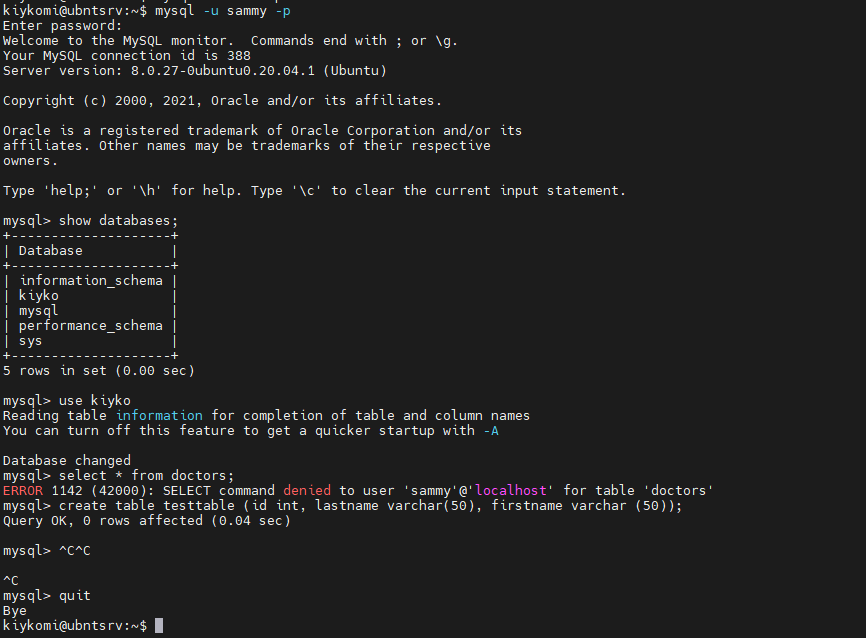
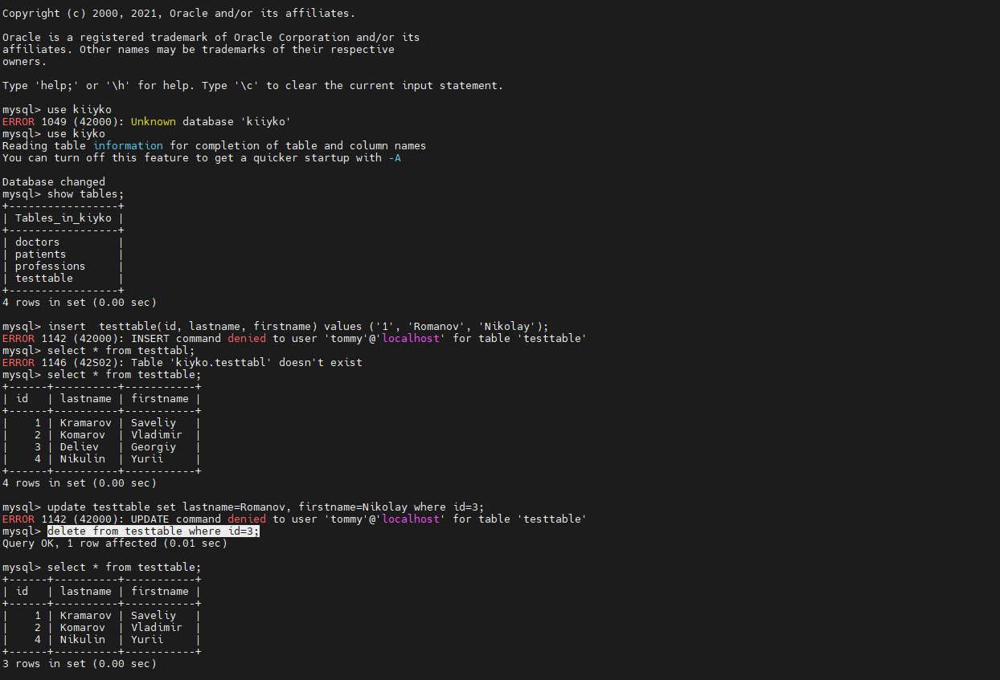
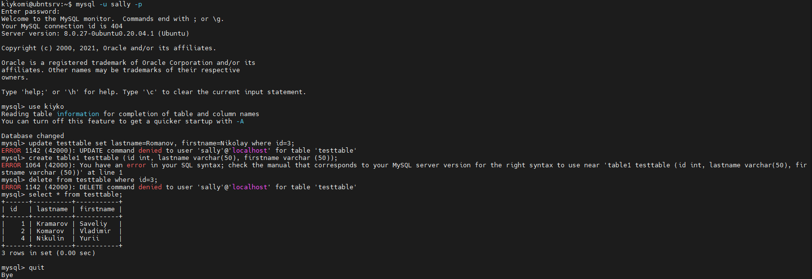
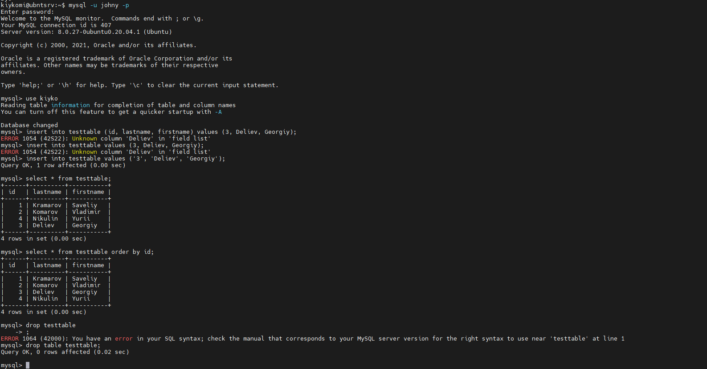
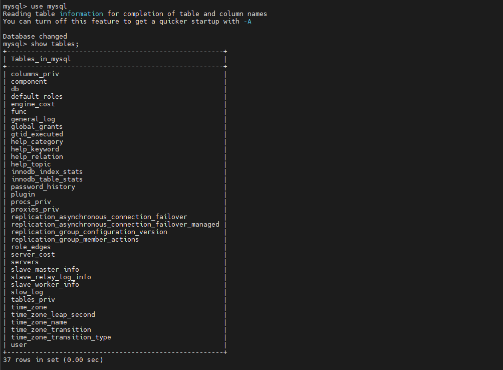
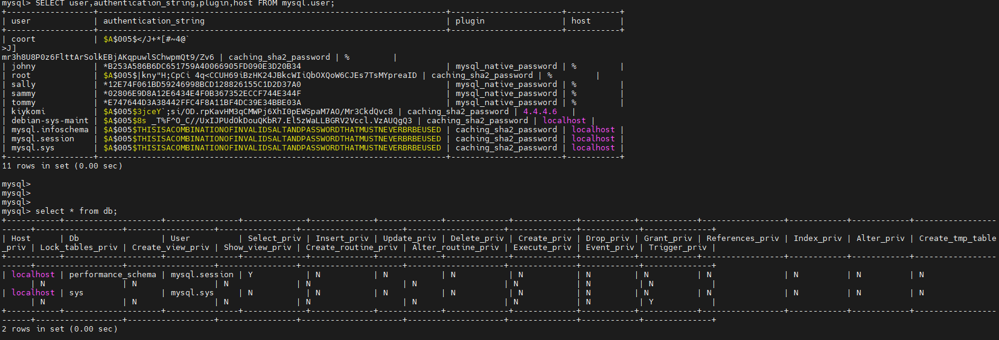
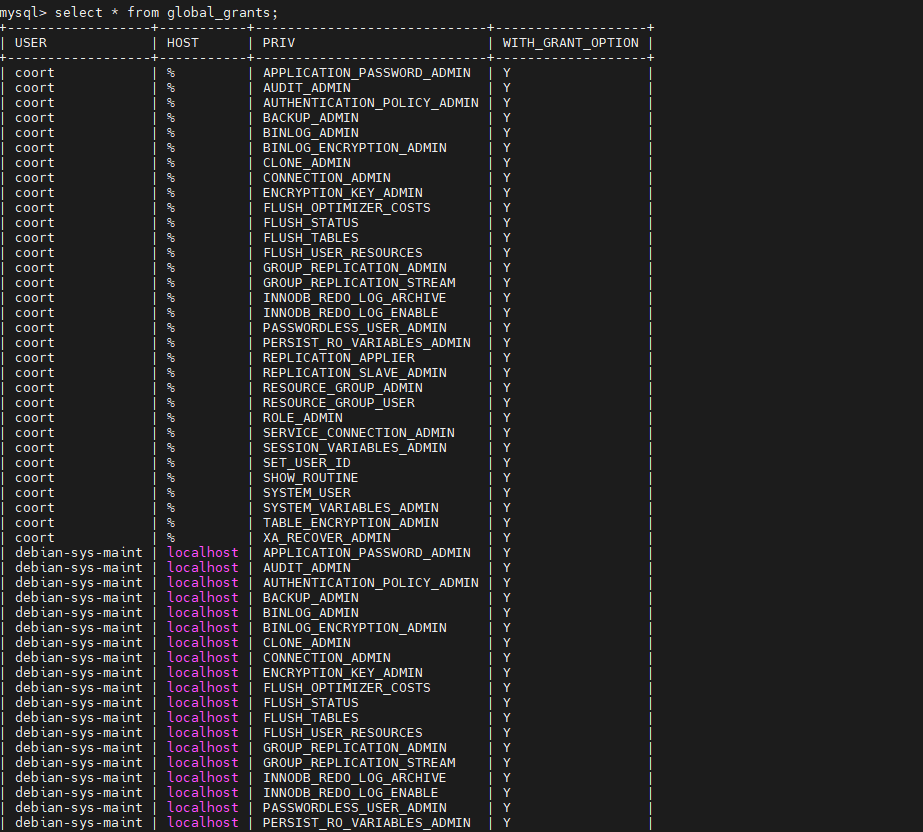

# Task 4.1


## Part 1.


### Installing MySQL.

```
sudo apt install mysql-server -y
```


### Configure MySQL

```
sudo mysql_secure_installation
```


### Configuring acces to  MySQL

```
sudo mysql

SELECT user,authentication_string,plugin,host FROM mysql.user;

ALTER USER 'root'@'%' IDENTIFIED WITH caching_sha2_password BY '111';

FLUSH PRIVILEGES;

SELECT user,authentication_string,plugin,host FROM mysql.user;

CREATE USER 'kiykomi'@'%' IDENTIFIED BY '123456Ss!';

GRANT ALL PRIVILEGES ON *.* TO 'kiykomi'@'%' WITH GRANT OPTION;

FLUSH PRIVILEGES;

exit;
```


### Let's configure firewall to allow work with port 3306 (MySQL port)

```
sudo ufw allow from remote_IP_address to any port 3306
```


###  Creating new database


```
mysql -u root -p

show databases;

create database kiyko;

use kiyko;

```

### Create and filling the tabels

```
create table doctors  (id integer auto_increment Primary Key, LastName varchar(50), FirstName varchar(50));

create table patients (id integer auto_increment Primary Key, LastName varchar(50), FirstName varchar(50));

create table professions (id integer auto_increment Primary Key, Speciality varchar(50), Cabinet INT);

insert into doctors (lastname, firstname) values ('Chapayev', 'Vasiliy'), ('Zhivago', 'Doctor'), ('Avicenna', 'Doctor');

insert into patients (lastname, firstname) values ('Ivanov', 'Ivan'), ('Petrov', 'Petr'), ('Sidorov', 'Sidor'), ('Saveliev', 'Saveliy'), ('Mikhailov', 'Mikhail');

insert into professions (speciality, cabinet) values ('Ginekology', '101'), ('Pediatria', '102'), ('Otorinolaringology', '103'), ('Dermatology', '103'), ('surgery', '104');
```


### Let's look how operate with data in tables (listing data, order, group and other)


```
select * from doctors;

select * from patients;

select * from professions;

select *  from professions where speciality='ginekology';

select *  from professions where id=3;

select *  from professions where id > 2;

select *  from doctors order by firstname;

select *  from doctors where firstname like 'doctor' and id < 3;

select *  from doctors group by id;

select *  from doctors group by LastName, id;

```


### Let's create users with names Sammy, Tommy, Sally, Johny


```
CREATE USER 'sammy'@'%' IDENTIFIED WITH mysql_native_password BY 'Passwd111!';

GRANT CREATE, ALTER on *.* TO 'sammy'@'%' WITH GRANT OPTION;

CREATE USER 'tommy'@'%' IDENTIFIED WITH mysql_native_password BY 'Passwd222!';

GRANT DROP, DELETE, SELECT on *.* TO 'tommy'@'%' WITH GRANT OPTION;

CREATE USER 'sally'@'%' IDENTIFIED WITH mysql_native_password BY 'Passwd333!';

GRANT SELECT on *.* TO 'sally'@'%' WITH GRANT OPTION;

CREATE USER 'johny'@'%' IDENTIFIED WITH mysql_native_password BY 'Passwd444!';

GRANT CREATE, ALTER, DROP, INSERT, UPDATE, DELETE, SELECT, REFERENCES, RELOAD on *.* TO 'johny'@'%' WITH GRANT OPTION;

FLUSH PRIVILEGES;

quit
```




### OK, now  let's check users privilegies on a practic


Sammy have a rights to create tables and modify\add columns.

```
mysql -u sammy -p

use kiyko

select * from doctors;

create table testtable (id int, lastname varchar(50), firstname varchar (50));

quit
```




Tommy have rights to Delete some data from tables, delete tables and view info  in tables.


```
mysql -u tommy -p

use kiyko


update testtable set lastname=Romanov, firstname=Nikolay where id=3;

delete from testtable where id=3;


quit
```



Sally have only viewing right.

```
mysql -u sally -p

create table1 testtable (id int, lastname varchar(50), firstname varchar (50));

update testtable set lastname=Romanov, firstname=Nikolay where id=3;

delete from testtable where id=3;

quit
```



And Johny have all rights for this database/

```
mysql -u johny -p

use kiyko

insert into testtable values ('3', 'Deliev', 'Georgiy');

select * from testtable;


select * from testtable order by id;

drop table testtable;

quit
```



### Let's look to database MySQL

```
use mysql

show tables;

SELECT user,authentication_string,plugin,host FROM mysql.user;

select * from db;

select * from global_grants;
```








