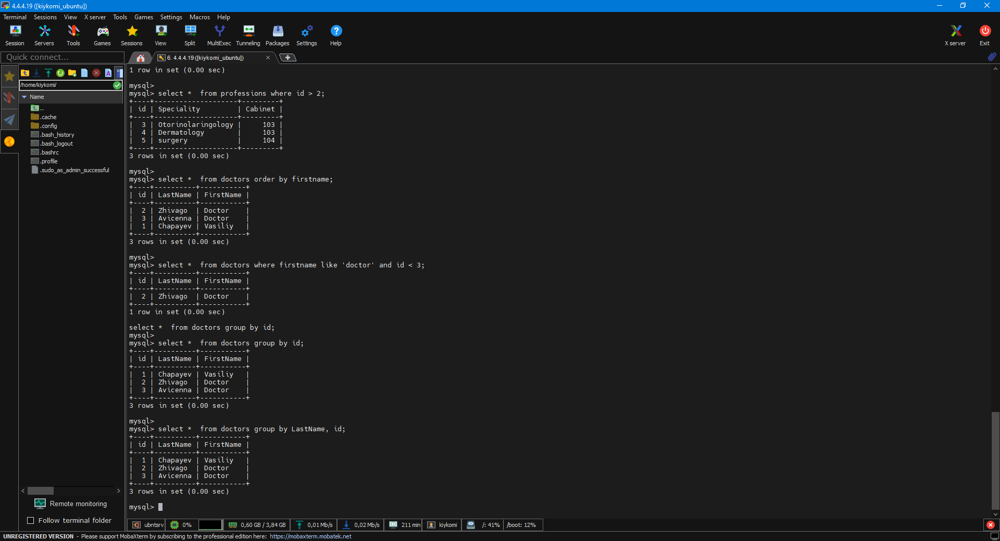
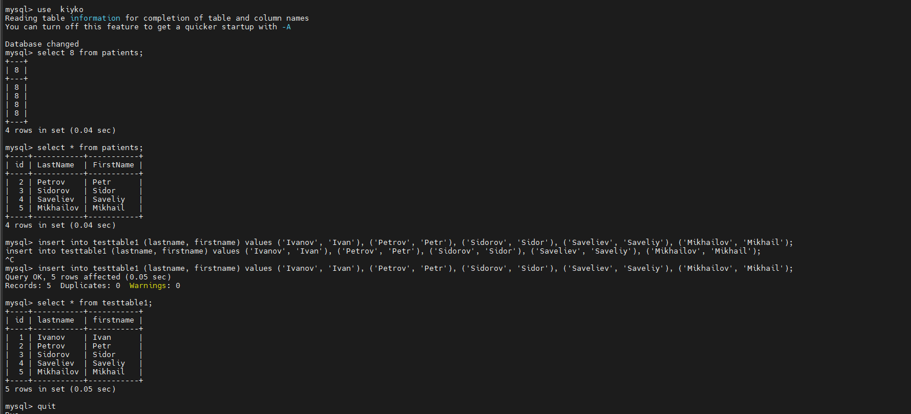
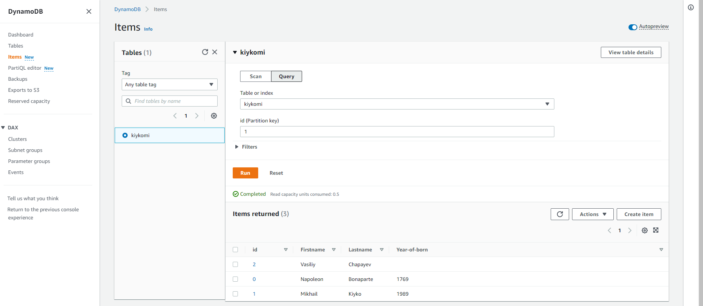
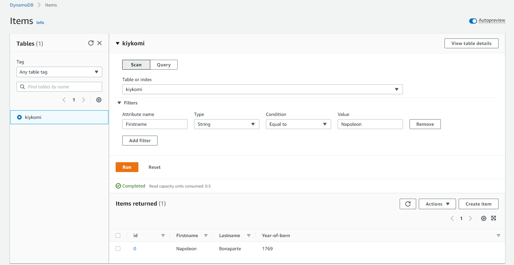
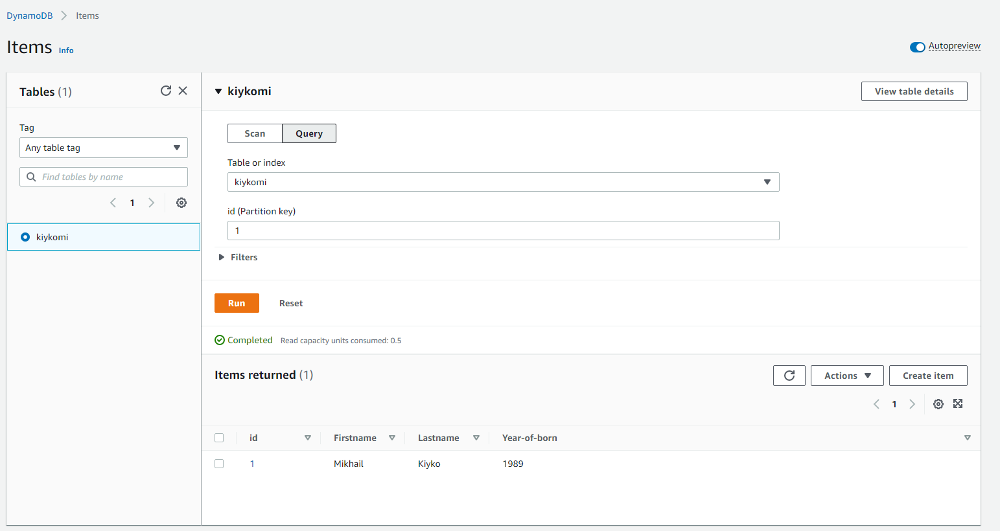
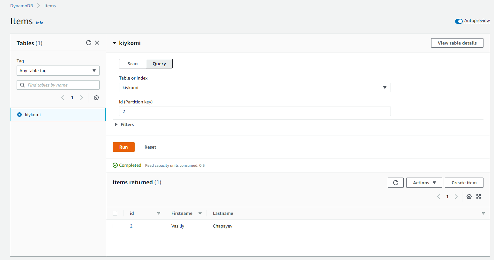

# Task 4.1


## Part 1.


### Installing MySQL.

```
sudo apt install mysql-server -y
```


### Configure MySQL

```
sudo mysql_secure_installation
```


### Configuring acces to  MySQL

```
sudo mysql

SELECT user,authentication_string,plugin,host FROM mysql.user;

ALTER USER 'root'@'%' IDENTIFIED WITH caching_sha2_password BY '111';

FLUSH PRIVILEGES;

SELECT user,authentication_string,plugin,host FROM mysql.user;

CREATE USER 'kiykomi'@'%' IDENTIFIED BY '123456Ss!';

GRANT ALL PRIVILEGES ON *.* TO 'kiykomi'@'%' WITH GRANT OPTION;

FLUSH PRIVILEGES;

exit;
```


### Let's configure firewall to allow work with port 3306 (MySQL port)

```
sudo ufw allow from remote_IP_address to any port 3306
```


###  Creating new database


```
mysql -u root -p

show databases;

create database kiyko;

use kiyko;

```

### Create and filling the tabels

```
create table doctors  (id integer auto_increment Primary Key, LastName varchar(50), FirstName varchar(50));

create table patients (id integer auto_increment Primary Key, LastName varchar(50), FirstName varchar(50));

create table professions (id integer auto_increment Primary Key, Speciality varchar(50), Cabinet INT);

insert into doctors (lastname, firstname) values ('Chapayev', 'Vasiliy'), ('Zhivago', 'Doctor'), ('Avicenna', 'Doctor');

insert into patients (lastname, firstname) values ('Ivanov', 'Ivan'), ('Petrov', 'Petr'), ('Sidorov', 'Sidor'), ('Saveliev', 'Saveliy'), ('Mikhailov', 'Mikhail');

insert into professions (speciality, cabinet) values ('Ginekology', '101'), ('Pediatria', '102'), ('Otorinolaringology', '103'), ('Dermatology', '103'), ('surgery', '104');
```


### Let's look how operate with data in tables (listing data, order, group and other)


```
select * from doctors;

select * from patients;

select * from professions;

select *  from professions where speciality='ginekology';

select *  from professions where id=3;

select *  from professions where id > 2;

select *  from doctors order by firstname;

select *  from doctors where firstname like 'doctor' and id < 3;

select *  from doctors group by id;

select *  from doctors group by LastName, id;

```




### Let's create users with names Sammy, Tommy, Sally, Johny


```
CREATE USER 'sammy'@'%' IDENTIFIED WITH mysql_native_password BY 'Passwd111!';

GRANT CREATE, ALTER on *.* TO 'sammy'@'%' WITH GRANT OPTION;

CREATE USER 'tommy'@'%' IDENTIFIED WITH mysql_native_password BY 'Passwd222!';

GRANT DROP, DELETE, SELECT on *.* TO 'tommy'@'%' WITH GRANT OPTION;

CREATE USER 'sally'@'%' IDENTIFIED WITH mysql_native_password BY 'Passwd333!';

GRANT SELECT on *.* TO 'sally'@'%' WITH GRANT OPTION;

CREATE USER 'johny'@'%' IDENTIFIED WITH mysql_native_password BY 'Passwd444!';

GRANT CREATE, ALTER, DROP, INSERT, UPDATE, DELETE, SELECT, REFERENCES, RELOAD on *.* TO 'johny'@'%' WITH GRANT OPTION;

FLUSH PRIVILEGES;

quit
```


### OK, now  let's check users privilegies on a practic


Sammy have a rights to create tables and modify\add columns.

```
mysql -u sammy -p

use kiyko

select * from doctors;

create table testtable (id int, lastname varchar(50), firstname varchar (50));

quit
```


Tommy have rights to Delete some data from tables, delete tables and view info  in tables.


```
mysql -u tommy -p

use kiyko


update testtable set lastname=Romanov, firstname=Nikolay where id=3;

delete from testtable where id=3;


quit
```


Sally have only viewing right.

```
mysql -u sally -p

create table1 testtable (id int, lastname varchar(50), firstname varchar (50));

update testtable set lastname=Romanov, firstname=Nikolay where id=3;

delete from testtable where id=3;

quit
```


And Johny have all rights for this database/

```
mysql -u johny -p

use kiyko

insert into testtable values ('3', 'Deliev', 'Georgiy');

select * from testtable;


select * from testtable order by id;

drop table testtable;

quit
```


### Let's look to database MySQL

```
use mysql

show tables;

SELECT user,authentication_string,plugin,host FROM mysql.user;

select * from db;

select * from global_grants;
```


## Part 2.

```
mysqldump -u root -p kiyko > /home/kiykomi/kiyko_base.sql

mysql -u root -p

drop table kiyko.patients;

show use kiyko;

show tables;

exit

mysql -u root -p kiyko < /home/kiykomi/kiyko_base.sql

mysql -u root -p

use kiyko

show tables;

select * from patients;

quit
```


### And now let's export our base to AWS.

```
mysql -u kyikomi -h database-kiyko.csgz8pbkwn5o.eu-central-1.rds.amazonaws.com -p123456Ss!

show databases;

create database kiyko;

show databases;

quit


mysql -u kyikomi -h database-kiyko.csgz8pbkwn5o.eu-central-1.rds.amazonaws.com -p123456Ss! kiyko < /home/kiykomi/kiyko_base.sql

show databases;

use kiyko

show tables;

create table testtable1 (id integer auto_increment Primary Key, lastname varchar(50),  firstname varchar(50));

insert into testtable1 (lastname, firstname) values ('Ivanov', 'Ivan'), ('Petrov', 'Petr'), ('Sidorov', 'Sidor'), ('Saveliev', 'Saveliy'), ('Mikhailov', 'Mikhail');

select * from testtable1;

quit

mysqldump -u kyikomi -h database-kiyko.csgz8pbkwn5o.eu-central-1.rds.amazonaws.com -p123456Ss! kiyko > /home/kiykomi/kiyko_base_RDS.sql

```





## Part 3.


### I have create new DunamoDB at Amazon AWS? enter a data to new base named "kiykomi" and query data ffrom base  with Scan and Query functions.










```
To create new lines in table I use next construction:
{
  "id": {
    "N": "0"
  },
  "Lastname": {
    "S": "Bonaparte"
  },
  "Firstname": {
    "S": "Napoleon"
  },
  "Year-of-born": {
    "S": "1769"
  }
}

```

Also, tables Doctors and Professions are connected with function Constraint and  Foreign.

As example, this is sources of my Data Base:

```
-- --------------------------------------------------------
-- Хост:                         4.4.4.19
-- Версия сервера:               8.0.27-0ubuntu0.20.04.1 - (Ubuntu)
-- Операционная система:         Linux
-- HeidiSQL Версия:              10.2.0.5599
-- --------------------------------------------------------

/*!40101 SET @OLD_CHARACTER_SET_CLIENT=@@CHARACTER_SET_CLIENT */;
/*!40101 SET NAMES utf8 */;
/*!50503 SET NAMES utf8mb4 */;
/*!40014 SET @OLD_FOREIGN_KEY_CHECKS=@@FOREIGN_KEY_CHECKS, FOREIGN_KEY_CHECKS=0 */;
/*!40101 SET @OLD_SQL_MODE=@@SQL_MODE, SQL_MODE='NO_AUTO_VALUE_ON_ZERO' */;


-- Дамп структуры базы данных kiyko
CREATE DATABASE IF NOT EXISTS `kiyko` /*!40100 DEFAULT CHARACTER SET utf8mb4 COLLATE utf8mb4_0900_ai_ci */ /*!80016 DEFAULT ENCRYPTION='N' */;
USE `kiyko`;

-- Дамп структуры для таблица kiyko.doctors
CREATE TABLE IF NOT EXISTS `doctors` (
  `id` int NOT NULL AUTO_INCREMENT,
  `LastName` varchar(50) DEFAULT NULL,
  `FirstName` varchar(50) DEFAULT NULL,
  PRIMARY KEY (`id`),
  UNIQUE KEY `ln_index` (`LastName`),
  UNIQUE KEY `unique_LastName` (`LastName`)
) ENGINE=InnoDB AUTO_INCREMENT=4 DEFAULT CHARSET=utf8mb4 COLLATE=utf8mb4_0900_ai_ci;

-- Дамп данных таблицы kiyko.doctors: ~3 rows (приблизительно)
/*!40000 ALTER TABLE `doctors` DISABLE KEYS */;
REPLACE INTO `doctors` (`id`, `LastName`, `FirstName`) VALUES
  (1, 'Chapayev', 'Vasiliy'),
  (2, 'Zhivago', 'Doctor'),
  (3, 'Avicenna', 'Doctor');
/*!40000 ALTER TABLE `doctors` ENABLE KEYS */;

-- Дамп структуры для таблица kiyko.patients
CREATE TABLE IF NOT EXISTS `patients` (
  `id` int NOT NULL AUTO_INCREMENT,
  `LastName` varchar(50) DEFAULT NULL,
  `FirstName` varchar(50) DEFAULT NULL,
  PRIMARY KEY (`id`),
  KEY `LastName` (`LastName`)
) ENGINE=InnoDB AUTO_INCREMENT=6 DEFAULT CHARSET=utf8mb4 COLLATE=utf8mb4_0900_ai_ci;

-- Дамп данных таблицы kiyko.patients: ~4 rows (приблизительно)
/*!40000 ALTER TABLE `patients` DISABLE KEYS */;
REPLACE INTO `patients` (`id`, `LastName`, `FirstName`) VALUES
  (1, 'Ivanov', 'Ivan'),
  (2, 'Petrov', 'Petr'),
  (3, 'Sidorov', 'Sidor'),
  (4, 'Saveliev', 'Saveliy'),
  (5, 'Mikhailov', 'Mikhail');
/*!40000 ALTER TABLE `patients` ENABLE KEYS */;

-- Дамп структуры для таблица kiyko.professions
CREATE TABLE IF NOT EXISTS `professions` (
  `id` int NOT NULL AUTO_INCREMENT,
  `Speciality` varchar(50) DEFAULT NULL,
  `Cabinet` int DEFAULT NULL,
  `doc_id` int DEFAULT NULL,
  PRIMARY KEY (`id`),
  KEY `docid` (`doc_id`),
  KEY `Cabinet` (`Cabinet`),
  CONSTRAINT `lnk_doctors_professions` FOREIGN KEY (`doc_id`) REFERENCES `doctors` (`id`) ON DELETE CASCADE ON UPDATE CASCADE
) ENGINE=InnoDB AUTO_INCREMENT=6 DEFAULT CHARSET=utf8mb4 COLLATE=utf8mb4_0900_ai_ci;

-- Дамп данных таблицы kiyko.professions: ~5 rows (приблизительно)
/*!40000 ALTER TABLE `professions` DISABLE KEYS */;
REPLACE INTO `professions` (`id`, `Speciality`, `Cabinet`, `doc_id`) VALUES
  (1, 'Ginekology', 101, 1),
  (2, 'Pediatria', 102, 2),
  (3, 'Otorinolaringology', 103, 2),
  (4, 'Dermatology', 103, 3),
  (5, 'surgery', 104, 1);
/*!40000 ALTER TABLE `professions` ENABLE KEYS */;

/*!40101 SET SQL_MODE=IFNULL(@OLD_SQL_MODE, '') */;
/*!40014 SET FOREIGN_KEY_CHECKS=IF(@OLD_FOREIGN_KEY_CHECKS IS NULL, 1, @OLD_FOREIGN_KEY_CHECKS) */;
/*!40101 SET CHARACTER_SET_CLIENT=@OLD_CHARACTER_SET_CLIENT */;

```


# List of used information sources:


https://www.digitalocean.com/community/tutorials/how-to-install-mysql-on-ubuntu-20-04-ru - How to install MySQL on Ubuntu.

https://www.digitalocean.com/community/tutorials/how-to-allow-remote-access-to-mysql - How To Allow Remote Access to MySQL.

https://www.geeksforgeeks.org/sql-ddl-dml-tcl-dcl/?ref=lbp - DDL, DML, TCL and DCL commands.

https://coderoad.ru/15872543/%D0%94%D0%BE%D1%81%D1%82%D1%83%D0%BF-%D0%BA-%D1%83%D0%B4%D0%B0%D0%BB%D0%B5%D0%BD%D0%BD%D0%BE%D0%B9-%D0%B1%D0%B0%D0%B7%D0%B5-%D0%B4%D0%B0%D0%BD%D0%BD%D1%8B%D1%85-mysql-%D0%B8%D0%B7-%D0%BA%D0%BE%D0%BC%D0%B0%D0%BD%D0%B4%D0%BD%D0%BE%D0%B9-%D1%81%D1%82%D1%80%D0%BE%D0%BA%D0%B8 - How connect to remote MySQL node with CLI.

https://www.sqlshack.com/how-to-backup-and-restore-mysql-databases-using-the-mysqldump-command/ - How to backup and restore MySQL databases using the mysqldump command.

https://dev.mysql.com/doc/refman/5.7/en/mysqldump-sql-format.html - Dumping Data in SQL Format with mysqldump.

https://metanit.com/sql/mysql/2.6.php - Changing tables and columns.

https://tproger.ru/translations/sql-recap/ - Main command of MySQL, musthave!!!

https://metanit.com/sql/mysql/1.3.php - How to  use MySQL Workbench.

https://metanit.com/sql/mysql/4.9.php - Operator "EXIST".

https://tproger.ru/translations/troubleshoot-common-errors-in-mysql/ - Typical problems With MySQL.

https://andreyex.ru/bazy-dannyx/baza-dannyx-mysql/kak-izmenit-parol-polzovatelya-mysql-mariadb/ - How to change a password for MySQL.


