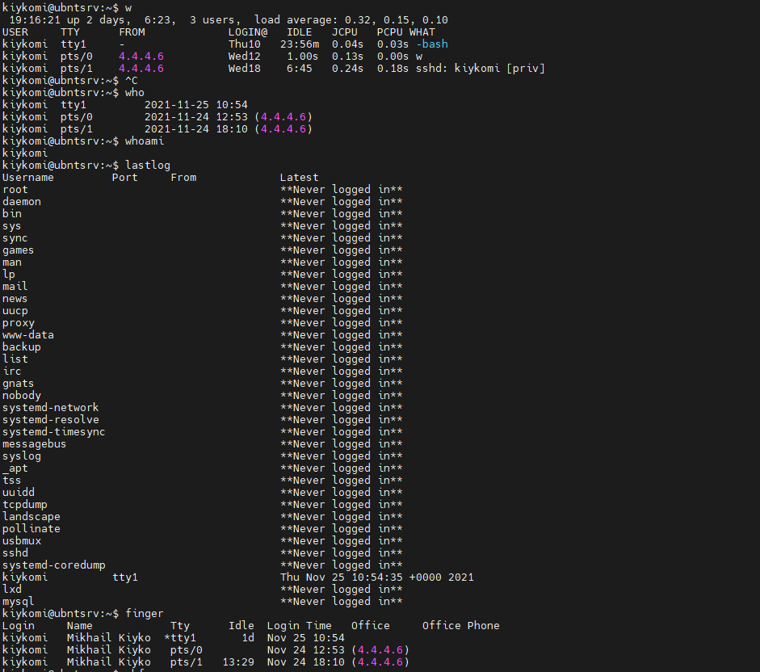
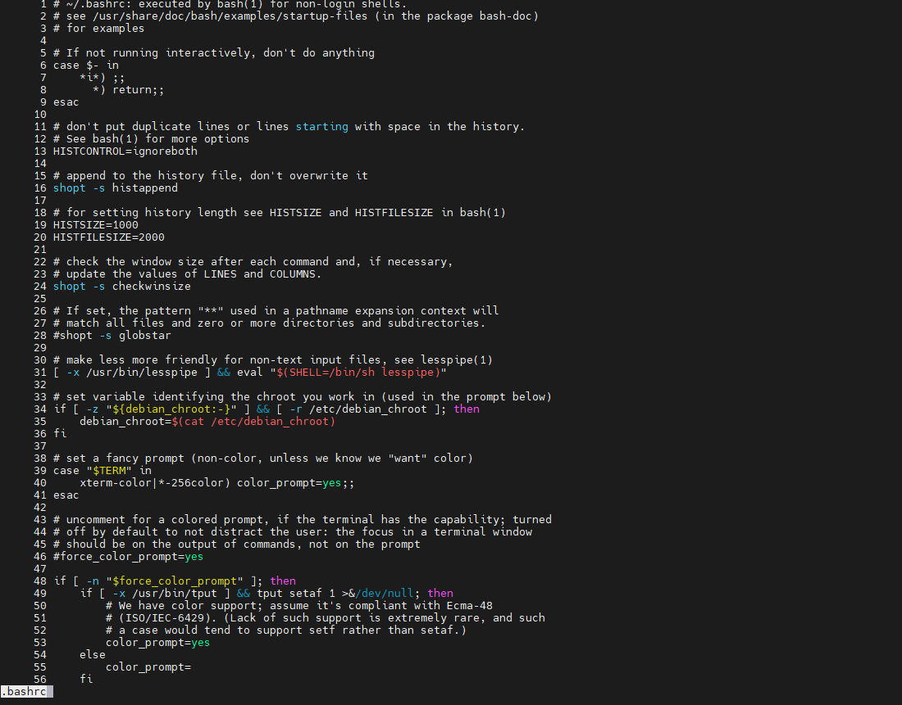
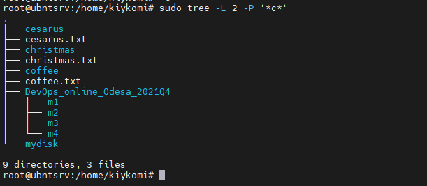
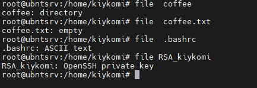
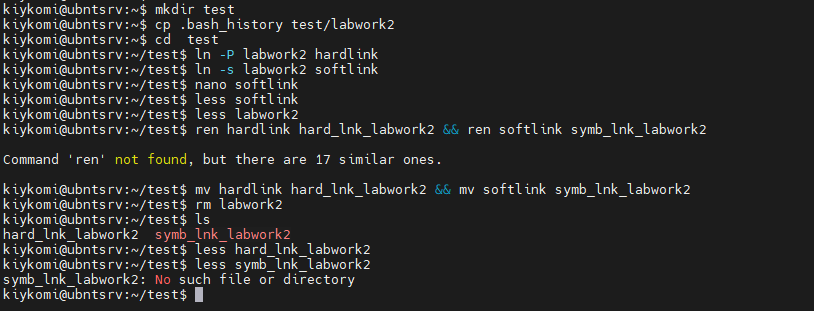
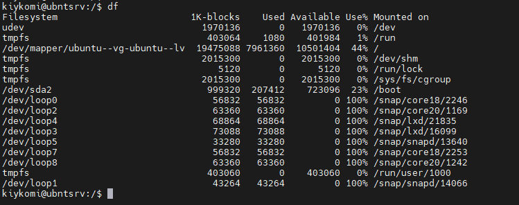
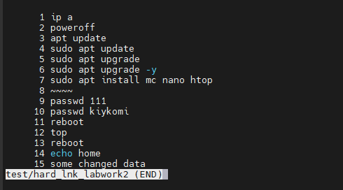
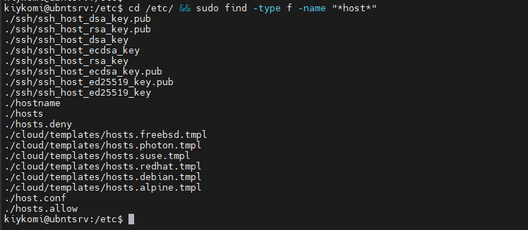
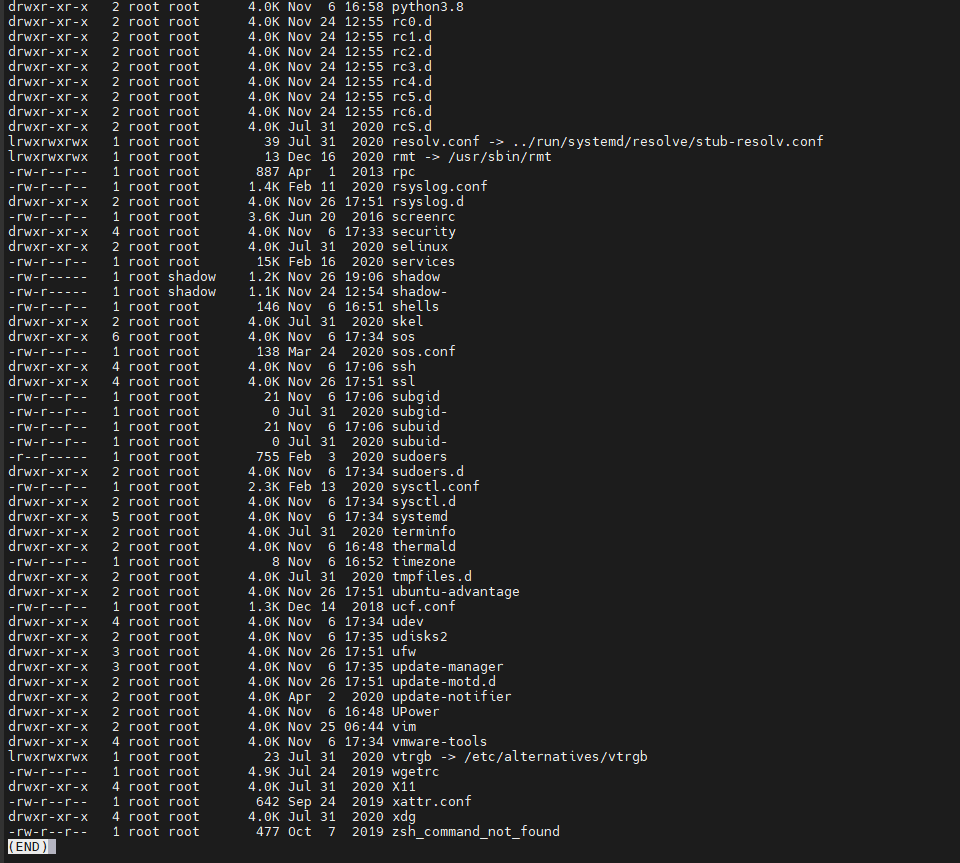
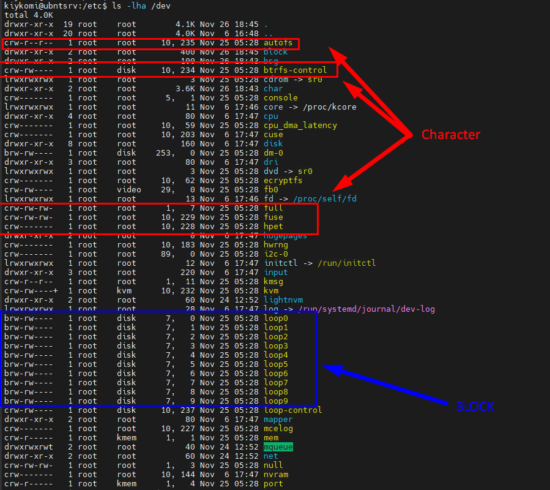

# Task 5.1

## I don't describe all what I must to  do  in this tasks, I describe only methods and results.


## Part 1.


### 1) For login in system as "root" user I use command:

```
sudo su
```

### 2) Command "passwd" exists for working with the user password, with this command you ca nchange, delete passwords for users, set expiration date and see the status of passwords. Command change next files when she works:

```
/etc/passwd - user accounts information.
/etc/shadow - secure user account information.
/etc/pam.d/passwd  - PAM configuration for passwd.
```

### 3)  For determine users in host I use commands like:

```
cat /etc/passwd - shows what users registered in system;
sed 's/:.*//' /etc/passwd - this command like prewious, but displaying short list - usernames only;
last -a and lastlog - this commands use for display who and when login in system.
```
Also we can use next commands for describe users in system - "w", "finger" and "who". 




### 4) I can  change personal info about myself with a command like:

```
chfn - uses for change user info displayed by FINGER command.
```


### 5) For get help we can use "man" command. Construction must be like man <command>.

For example:

```
man finger 

man w

finger -l kiykomi - Produces a multi-line format displaying all of the information described for the -s option as well as the user's home directory, home phone number, login shell, mail status, and the con-
           tents of the files ".plan", ".project", ".pgpkey" and ".forward" from the user's home directory.

finger -m kiykomi - Prevent matching of user names.  User is usually a login name; however, matching will also be done on the users' real names, unless the -m option is supplied.  All name matching performed
           by finger is case insensitive.

w -s - use short format of listed info.

w -i - Display IP address instead of hostname for from field.

```


### 6) Command "less" exist for reading big text files in terminal without clogging up the terminal.




### 7) For read documentation of a "finger" command I use nex command:

```
man finger
```


### 8) For this task I used nex command:

```
ls -alh --group-directories-first
```


### Thiss command help me list all files in my home directory. Key -a - helpful for show all files  and directories, key -l - shows all as one list with columns, key -h - allows to see information on a human-readable format, key --group-directories-first - allows to sort listing and seeing group of directories before files.


## Part 2.

### 1) For this task I used following command:

```
sudo tree -L 2 -P '*c*'

```




### 2) To determining file type I used following command - file.

```
file  coffee
file  coffee.txt
file  .bashrc
file RSA_kiykomi
```




### 3) To enter in mu  hode directory I usually use follow commands:

With relative path

```
cd $home 
cd ~ 
```

And absolute path
```
cd /home/kiykomi
```


### 4) I answered this question in point 8 of part 1 of this Task.


### 5) For next task I used following commands:

```
mkdir subdir_for_task_5.1
tree -dL 1 > subdir_for_task_5.1/dirinfo.txt
cat subdir_for_task_5.1/dirinfo.txt
cp subdir_for_task_5.1/dirinfo.txt ~/dirinfo_rel.txt
cp subdir_for_task_5.1/dirinfo.txt /home/kiykomi/dirinfo_abs.txt
rm -rI subdir_for_task_5.1
rm dirinfo_abs.txt dirinfo_rel.txt
```


### 6) On this task  I used  following commands:

```
mkdir test
cp .bash_history test/labwork2
cd  test
ln -P labwork2 hardlink
ln -s labwork2 softlink
nano softlink
less softlink
less labwork2
mv hardlink hard_lnk_labwork2 && mv softlink symb_lnk_labwork2
rm labwork2
less hard_lnk_labwork2
less symb_lnk_labwork2
```
OK,  let's define what is the hardlink and symlink.
Hardlink - it's a link, what specify path not to the file, but to the recording itself on a filesystem, hardlinks works only in one partition and don't be used in a network path or from another drive, hardlinks works only with files and not work with folders.
Symbolic link or Symlink -  it's like a windows shortcat file (.lnk), she only specify path to file, but she works with network paths, different partitions and folders.

How  described in our example - when file was changed, text in hard and soft links equal text in originsl file, but when we delete original  file - hardlink is working (because he know where file in harddrive) and symlink is not works, because she losses the file, what specified in she's path.





### 7) Let's use "locate" command to find "sqiud" and "traceroute" sequencenses:

```
sudo apt install locate  -y
sudo updatedb
locate -A squid
locate -A traceroute
```


### 8) To seeing what's partitions is moubted in system we can use following command:

```
df
```



### 9) Let's count lines in our file:

```
less -N test/hard_lnk_labwork2
less test/hard_lnk_labwork2 | wc -l
```



### 10) Let's try to find all files in "/etc"  folder, whats containing "host" in the name:

```
cd /etc/ && sudo find -type f -name "*host*"
```



### 11) For this I used following command:

```
ls -al | grep "ss"
```


### 12) To screen by screen listing of the command I use these:

```
ls -alh | less
```



### 13) One of principles of Linux OS - all is a file (as in a joke about the point of view of Sigmund Freud, but only with file). All device files are stored in folder /dev. Also for simplify administrator work system have a DEVFS - special filesystem for devices, who automatically load modules for  devices, devfs contains in RAM. Devices are divided into Block (HDD, SCSI etc.) and Character (Symbolyc) (Mouse, COM, USB etc.). Block-devices read and write data with fixed size and user can access any written data, names of devices started with the "b". Character-devices read and write  the streams of the bytes, names of devices started with "c".




### 14) Linux contains 7 types of files:

Regular - denoted by symbol "-"
Directory - denoted by symbol "d"
Link File - denoted by symbol "l"
Character  DEvice File - denoted by symbol "c"
Local Socket File - denoted by symbol "s"
Named  Pipe  File - denoted by symbol "p"
Block Device File - denoted by symbol "b"

As we can see, these file types individually by filtering them out with grep ^<denote> command:

```
ls -la | grep ^-
ls -la | grep ^d
ls -la | grep ^l
ls -la | grep ^c
ls -la | grep ^b
ls -la | grep ^s
ls -la | grep ^p
```

Also we can use "file" command to seen whats the type of file:

```
file /dev/sdb1
file ~/test/hard_lnk_labwork2
file /dev/zfs
```


### 15) For seeing first 5 directory files that were recently accessed in the /etc directory we can use following command:

```
ls -ltr /etc | head -n 5
```


### For seeing last 5 directory files that were recently accessed in the /etc directory we can use "tail" command:

```
 ls -ltr /etc | tail -n 5
```


# Used information sources:

https://www.2daygeek.com/find-identify-file-types-in-linux/

https://it.wikireading.ru/34277

https://losst.ru/simvolicheskie-i-zhestkie-ssylki-linux

https://losst.ru/komanda-less-v-linux

https://qastack.ru/server/196498/locate-and-updatedb-doesnt-work-what-should-i-do