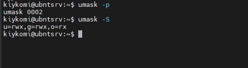

# Task 5.2

## 1) Let's take a look to these files (passwd and group):


## In the /etc/passwd we are see all  users accounts in system. Every new line has describe one of users and containing 7 fields separated by ":", for example - login, password hash, user id, default group id, gecos (phone number, First and lastname, etc.), home directory (start home directory), used shell (command interpreter). Pseudo user accounts are designed to run certain applications or own certain files. For example, syslog, tcpdump, daemon, proxy, syslog, news,  etc.

### For example, for user kiykomi I have next fields:


## And now  let's take a look on the /etc/group file. In this file stored names of groups and members of this groups. File "group" containing 4 fields - name of the group, encrypted password or symbol "x", group ID and list of members of this group. Every new line - is new group. By default, when a new user is created, his group is also created with the same name as the user's login name.

### For example, I listed my list of the groups:


## 2) User ID (UID) - is an unique identificator for every user in the system, it is used to determine which system resources a user can access. UID range - is a integer from 0 to 65535. Unix-like systems is reserving some id's for system needs, for example, id 0 - always reserved for root user, id 65534 - dor nobody user, id from 1 to 100 (101-499, 101-999) is reserver for system needs and variable from OS to OS.


## 3) Group ID or GID - is a unique identificator of the group. Like UID that have a ranges from 0 to 65535, where 0 - is  a root group, 65534 - nobody group, 1-999 - system reserved groups  and 1000-65533 - may be used for user groups etc...


##  4) Belonging user to specific group can be defined by file /etc/passwd, where described users, uid, gid and other. Also we can determine usergroups with command "groups", for example:

```
groups kiykomi
kiykomi : kiykomi adm cdrom sudo dip plugdev lxd
```


## 5) You can create new user with a command " add user  <username>", after entering command you must specify details for user like his Full name, password, room number, work phone, home phone and other info for GECOS. For example, I tryed to add user Tommy:

```
sudo adduser tommy
```


## 6) For change username or other user  information we can use "usermod" command, for example:

```
sudo usermod -l hardy tommy
```

## In this example we are changed username from tommy to hardy, also we can  change UID with  this command, where we use key "-u".


## 7) /etc/skel - it's a "skeleton" folder for initiate a home directory for a new user, depends on the directory /etc/default/useradd


## 8) To remove user  with his files frome the system we  can user  following commands:

```
sudo deluser --remove-home <username>;
or
sudo userdel -r <username>; (prefered, becouse it cleaning mail catalog /var/mail/$username)
```
### For example:


## 9) For lock and unlock  user accounts ased command "passwd" with keys -l and -u (Lock and Unlock), for example:

```
sudo passwd -l sara

sudo passwd -l sara
```


## 10) For provide password-free login with next user pwd change I use command " passwd -de  <username>". For example:

```
sudo passwd -de sara
```


## 11) On following screen we are seeing extended list of files and folder, let's describe it:


## 12) So, let's briefly describe access rights:
```
For example, we hawe next rights:

rwx-rx--x - this is sequence of three groups of three characters.

This may be pretend like xxx yyy zzz
xxx - owner, set of owner access rights.
yyy - group, set of group access rights.
zzz - other, set of access rights for others.

And in every sequence we have three characters - r,w,x, where:

w - rights for write;
r - rights for read;
x - rights for execute.

Also, we can set rights with a numbers:
7 - rwx
6 - rw
5 - rx
4 - r
0 - nothing
```


## 13) Firstly defining owner right, then group  right, then rights for others.


## 14) For change user rights used command "chmod", standart syntacs for command is "chmod <who> +/- <rights> <filename> or chmod <xxx> <filename>".  For example:

```
touch 111.txt
ls -l 111.txt
chmod 744 111.txt
```


## 15) Described in subtask 12. UMASK - this command uses for set the mask, what be applyed to new files. Applies according to principle "7" - "mask" = "value". For example, if we set mask "umask 002" then this be like command "chmod 775 filename" and be applied to every new created files. Also, the "x" parameter (executable) by default only applies to folders, but does not apply to files (for security reasons). Check the current mask we can with following command:

```
umask -p - for demical view
umask -S  - for text view
```



## 16) Sticky bit - additional attribute for files and directories in the UNIX-like systems. Sticky bit uses for deletion protect  of files, if user bot owner - he can't delet file or folder. For example, let's look on temp folder in ubuntu server:


## 17) For command scripts must be present "x" attribute  - a right to the execute. But if we are discut about general file attributes, then we have folloving attributes:
```
a - append only: this attribute allows a file to be added to, but not to be removed. It prevents accidental or malicious changes to files that record data, such as log files.
c - compressed: it causes the kernel to compress data written to the file automatically and uncompress it when it’s read back.
d - no dump: it makes sure the file is not backed up in backups where the dump utility is used
e - extent format: it indicates that the file is using extents for mapping the blocks on disk.
i - immutable: it makes a file immutable, which goes a step beyond simply disabling write access to the file. The file can’t be deleted, links to it can’t be created, and the file can’t be renamed.
j - data journaling: it ensures that on an Ext3 file system the file is first written to the journal and only after that to the data blocks on the hard disk.
s - secure deletion: it makes sure that recovery of a file is not possible after it has been deleted.
t - no tail-merging: Tail-merging is a process in which small data pieces at a file’s end that don’t fill a complete block are merged with similar pieces of data from other files.
u - undeletable: When a file is deleted, its contents are saved which allows a utility to be developed that works with that information to salvage deleted files.
A - no atime updates: Linux won’t update the access time stamp when you access a file.
D - synchronous directory updates: it makes sure that changes to files are written to disk immediately, and not to cache first.
S - synchronous updates: the changes on a file are written synchronously on the disk.
T - and top of directory hierarchy: A directory will be deemed to be the top of directory hierarchies for the purposes of the Orlov block allocator.
```
## For list attributes we can use command lsattr and change attributes with chattr:


##  As we can see, all files except mounted partition folder (mydisk)  have attributes "e" - extended format.


# Information sources used in this task:

https://linoxide.com/howto-show-file-attributes-in-linux/ - How to Show File Attributes in Linux

https://ru.wikipedia.org/wiki/Sticky_bit - Sticky bit

https://younglinux.info/bash/chmod - chmod command

https://losst.ru/komanda-chmod-linux - chmod command

https://losst.ru/prava-dostupa-k-fajlam-v-linux - access rights in linux

https://www.learnitguide.net/2016/08/how-to-lock-and-unlock-user-account-linux.html#:~:text=Option%201%3A%20Use%20the%20command%20%22passwd%20%2Dl%20username%22.&text=Locking%20password%20for%20user%20username.&text=Option%202%3A%20Use%20the%20command%20%22usermod%20%2Dl%20username%22.&text=How%20to%20unlock%20users%20in%20Linux%3F - lock and unlock users

https://losst.ru/kak-udalit-polzovatelya-linux - deletion user on Linux

https://www.thegeekdiary.com/understanding-the-etc-skel-directory-in-linux/ - Understanding the /etc/skel directory in Linux

https://linuxize.com/post/how-to-create-users-in-linux-using-the-useradd-command/ - How to Create Users in Linux

https://www.cyberciti.biz/faq/howto-change-rename-user-name-id/ - Linux Change or Rename User Name and UID

https://ru.wikipedia.org/wiki/%D0%98%D0%B4%D0%B5%D0%BD%D1%82%D0%B8%D1%84%D0%B8%D0%BA%D0%B0%D1%82%D0%BE%D1%80_%D0%BF%D0%BE%D0%BB%D1%8C%D0%B7%D0%BE%D0%B2%D0%B0%D1%82%D0%B5%D0%BB%D1%8F - user ID

https://ru.wikipedia.org/wiki/%2Fetc%2Fpasswd - /etc/passwd

https://andreyex.ru/linux/ponimanie-fajla-etc-passwd/ - Understading /etc/passwd

http://fkn.ktu10.com/?q=node/9321 - /etc/group  structure

https://losst.ru/komanda-ls-linux - ls command in Linux


