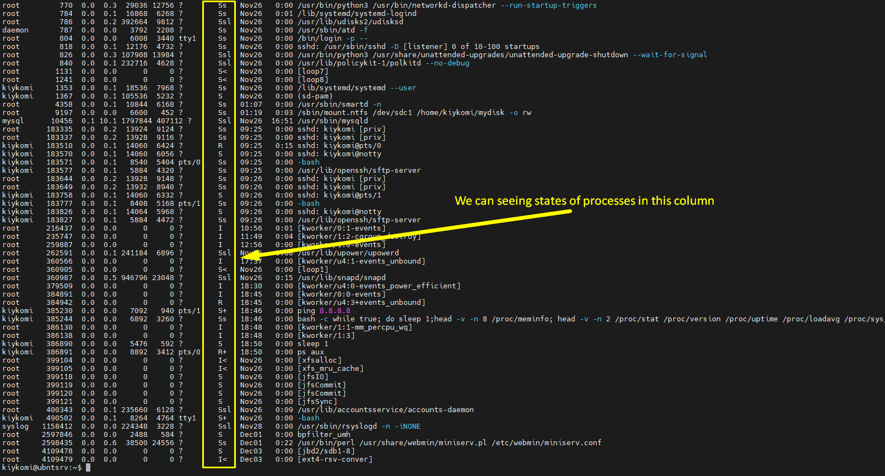
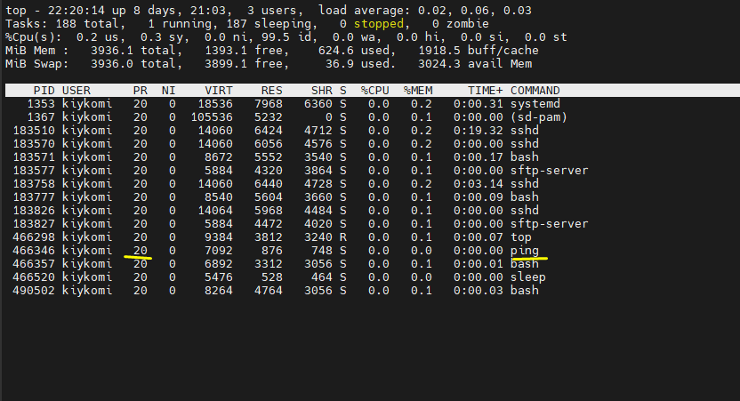

# Task 5.3


# Part 1

## 1) Processes in Linux have 5 states:
1. Running or Runnable (R);
2. Uninterruptible Sleep (D);
3. Interruptable Sleep (S);
4. Stopped (T);
5. Zombie (Z).

## We can seeing procees and they states with a "ps" command (or top, htop, etc.). Let's see process states descriptions from manual:
```
PROCESS STATE CODES
       Here are the different values that the s, stat and state output specifiers (header "STAT" or "S") will display to describe the state of a process:

               D    uninterruptible sleep (usually IO)
               I    Idle kernel thread
               R    running or runnable (on run queue)
               S    interruptible sleep (waiting for an event to complete)
               T    stopped by job control signal
               t    stopped by debugger during the tracing
               W    paging (not valid since the 2.6.xx kernel)
               X    dead (should never be seen)
               Z    defunct ("zombie") process, terminated but not reaped by its parent

       For BSD formats and when the stat keyword is used, additional characters may be displayed:

               <    high-priority (not nice to other users)
               N    low-priority (nice to other users)
               L    has pages locked into memory (for real-time and custom IO)
               s    is a session leader
               l    is multi-threaded (using CLONE_THREAD, like NPTL pthreads do)
               +    is in the foreground process group


```
## And let's to run command ```ps aux```





## 2) PSTREE - this utilite allow us to seeing tree of the processes in system.


## 3) PROCFS - it's a specific virtual filesystem (does't take up disk space). In GNU/Linux processes can't access the system kernel directly and use "/proc" directory, where is concentrated all information about system, RAM, CPU, loaded modules, etc. in readeble for human format.


## 4) We can get information abour CPU from folder /proc, info situated the file "cpuinfo", so let's see:
```
cat /proc/cpuinfo
```


## 5) For seeing processes with state and etc we can use follosing command (current user):
```
ps -au
```


## 6) Kernek processes - is a system processes born by "kthreadd" who have id=2 and all children of this process - the kernel processes. We can seeing these processes with following command:

```
sudo pstree 2
```
Where sudo - starts with root rights, pstree - list of processes in a tree view, 2 - PID.


## User processes  - is an every process who different of Kernel processes, we can see these processes with command:

```
ps -N --ppid=2 --pid=2
```


## 7) Ok, let's print all processes in the terminal with command:

```
ps -aux
```


## 8) For listing only processes  of my user I used command:

```
ps -au kiykomi
```


## 9) How we see in manual for ps (man ps), for viewing processes info we can use pgrep, pstree, top and proc.


## 10) The TOP command display processes info in real-time format.


## 11) For this task we can use command TOP  with "-u" key:

```
top -u kiykomi
```


## 12) For control TOP utilite we can use  interactive commands in work process with this, so let's give some examples:

```
d or s  - info renewal interval;
Y - list additional info about process like open ports, logs, open files etc;
W - write current  settings to the config file;
u - sort processes by username;
f - sort lines by choosen column;
V - display processes in the tree view;
L - search by word; 
z - switch on color/monochrome mode;
r - change priority of process.
```
Also TOP have a many keys for interactive commands, but I don't describe these.


## 13) Let's sort process.

### Sort by name


###  Sort by CPU using


###  Sort by Memory using


### Sort by Username


## 14) Process priority, like in an others OS, in Linux - is how many CPU time will be given for process compared to others. Priority have a value from 19 (the lowest  priority) to -20 (the highest priority), moreover for decrease the priority you can use a regular user, but for increase - you must have a superuser rights.
## For control process priority we can use following commands:
```
nice - set priority for launched process;
Example - nice -n 17 apt update;
renice - set priority for existing process, to indicate the process we must use PID;
Example - sudo renice -n -2 -p 466886
```



## 15) We can change priority in TOP with a "r" key:


## 16) We can kill some process with his PID:
```
kill 469862
```


### What signal we can send with a kill command says  command "kill -l"


For example:
```
SIGTERM - kill process as default;
SIGKILL - kill process, who ignore signal SIGTERM;
SIGSTOP - pause process;
SIGCONT - continue process.
```

```
kill -s SIGKILL 475559
```


```
kill -s SIGSTOP 476109
```


```
kill -s SIGCONT 476109
```


## 17) Let's to describe our operations with commands:

```
jobs - allows to see whats commands is in our session;
fg - let to bring command from background to foreground;
bg - allows to push command from foreground to background;
nohup - let to save started process after closing terminal session.
```
For example:


# Part 2.


# Used information sources:

* [bg, fg, nohup and jobs commands;](https://losst.ru/kak-zapustit-protsess-v-fone-linux)

* [kill process by TOP;](https://www.cyberforum.ru/linux/thread2550996.html)

* [kill command;](https://linux-faq.ru/page/komanda-kill)

* [how to kill the process;](https://losst.ru/kak-ubit-protsess-linux)

* [how to change process priority;](https://losst.ru/upravlenie-protsessami-v-linux#%D0%98%D0%B7%D0%BC%D0%B5%D0%BD%D0%B5%D0%BD%D0%B8%D0%B5_%D0%BF%D1%80%D0%B8%D0%BE%D1%80%D0%B8%D1%82%D0%B5%D1%82%D0%B0_%D0%BF%D1%80%D0%BE%D1%86%D0%B5%D1%81%D1%81%D0%BE%D0%B2)

* [TOP command;](https://losst.ru/komanda-top-v-linux) 

* [hot to  create a zombie process;](https://question-it.com/questions/4371557/sozdat-protsess-zombi)

* [zombie process;](https://losst.ru/zombi-protsessy-linux)

* [how to define kernel and user processes;](https://ru.stackoverflow.com/questions/528566/%D0%9A%D0%B0%D0%BA-%D0%B2-linux-%D0%BE%D0%BF%D1%80%D0%B5%D0%B4%D0%B5%D0%BB%D0%B8%D1%82%D1%8C-%D0%BF%D1%80%D0%BE%D1%86%D0%B5%D1%81%D1%81%D1%8B-%D1%8F%D0%B4%D1%80%D0%B0-%D0%B8-%D0%BF%D0%BE%D0%BB%D1%8C%D0%B7%D0%BE%D0%B2%D0%B0%D1%82%D0%B5%D0%BB%D1%8C%D1%81%D0%BA%D0%B8%D0%B5-%D0%BF%D1%80%D0%BE%D1%86%D0%B5%D1%81%D1%81%D1%8B)

* [processes in Linux;](https://life-prog.ru/view_linux.php?id=4)

* [CPU info;](https://losst.ru/harakteristiki-protsessora-v-linux)

* [processes in Linux;](https://docstore.mik.ua/manuals/ru/lnx_process/index.html)

* [understending Linux processes;](https://habr.com/ru/post/423049/https://habr.com/ru/post/423049/)

* [The PROCFS filesystem;](http://linux.yaroslavl.ru/docs/setup/mandrake/cl/proc-fs.html)

* [Proc filesystem.](https://losst.ru/fajlovaya-sistema-proc-v-linux)


