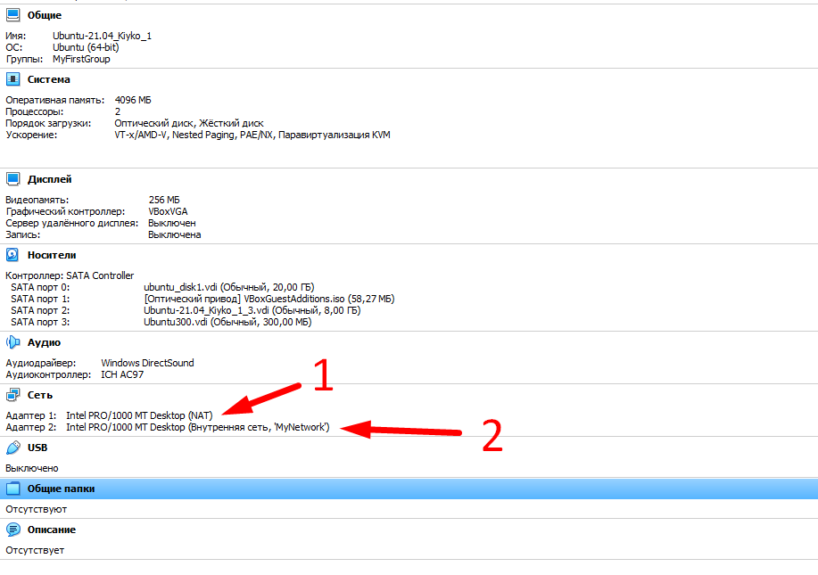
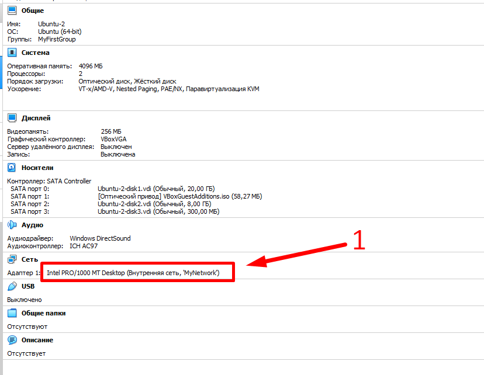
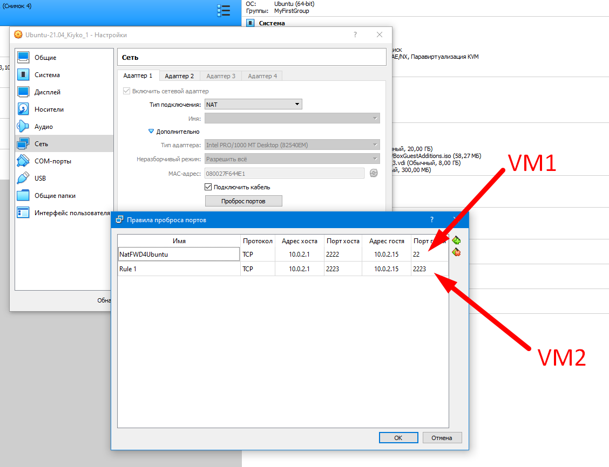
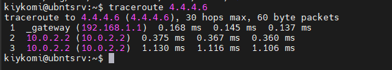
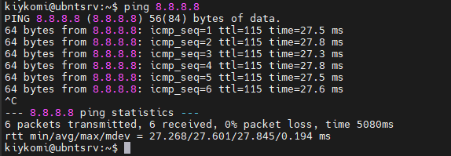
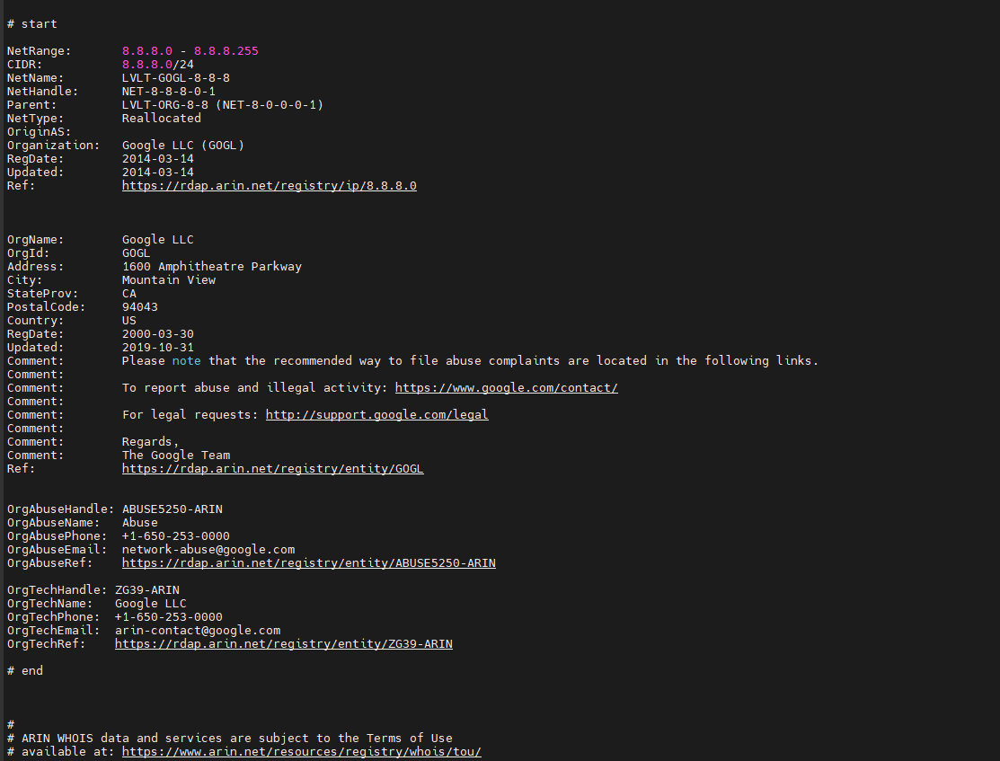
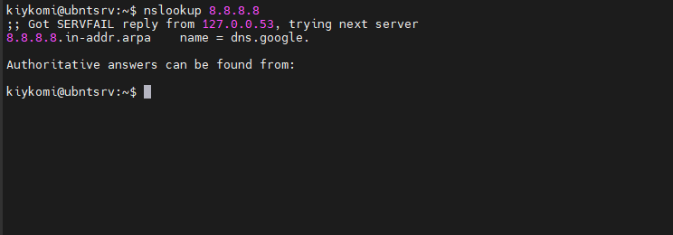
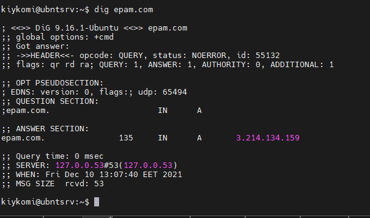
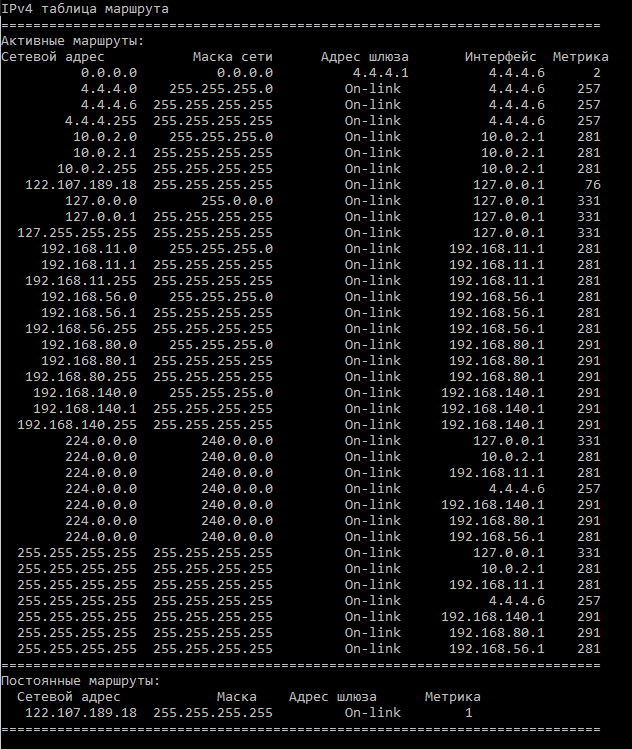
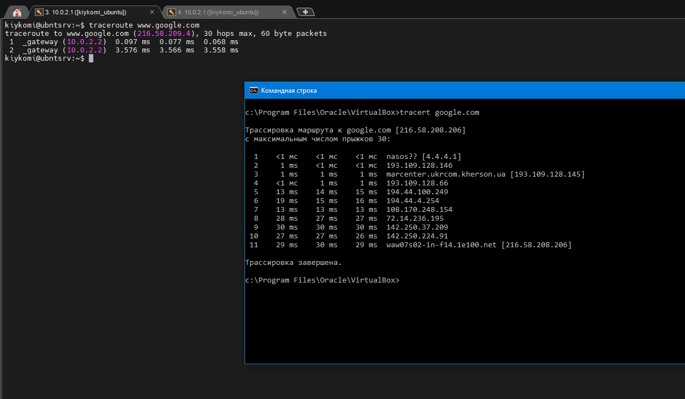

# Task 6.1


## 1) I have build this scheme of the network, where VM1 works like gateway for VM2. Also I set NAT forwarding on the VM1 NAT adapter for connection to VM1 and VM2.






## 2) For this exercise we must:

### 1. Configure interface enp0s8 on VM1 :
```
sudo ip addr add 192.168.1.1/255.255.255.0 broadcast  192.168.1.255 dev enp0s8
sudo ip link set enp0s8 up
```

### 2. Configure interface enp0s3 on VM2:
```
sudo ip addr add 192.168.1.10/255.255.255.0 broadcast  192.168.1.255 dev enp0s3
sudo ip link set enp0s3 up
sudo ip route add default 192.168.1.1 via enp0s3
sudo echo nameserver 8.8.8.8 >> /etc/resolv.conf
sudo echo nameserver 4.4.4.4 >> /etc/resolv.conf
```

### 3. Enable Forwarding on VM1:
```
sudo echo 1 > /proc/sys/net/ipv4/ip_forward
```

### 4. Add IPTABLES rules for forward SSH traffic to host VM2 and Masquerade traffic  from VM2:

```
sudo iptables -t nat -A POSTROUTING -o enp0s3 -j MASQUERADE
sudo iptables -t nat -A PREROUTING -i enp0s3 -p tcp --dport 2223 -j DNAT --to-destination 192.168.1.10:22
```


## 3) Checking route from VM2  to host.
```
traceroute 4.4.4.6
```



## 4) Checking internet connection.
```
ping 8.8.8.8
```




## 5) For find who owner of the rosource  I use "whois", this address (8.8.8.8) belongs to the Google DNS.
```
whois 8.8.8.8
```


or
```
nslookup 8.8.8.8
```



## 6) EPAM.COM have an address 3.214.134.159, for find this address I used command:
```
dig epam.com
```




## 7) For determine routes of my host based on Windows I use following command:
```
route print
```




## 8) My traceroute to the google.com:




# Used information sources:

[How to configure Linux network from CLI;](https://losst.ru/nastrojka-seti-iz-konsoli-ubuntu)


