# Task  6.2

## 1) Network settings of VM1, VM2 and VM3:

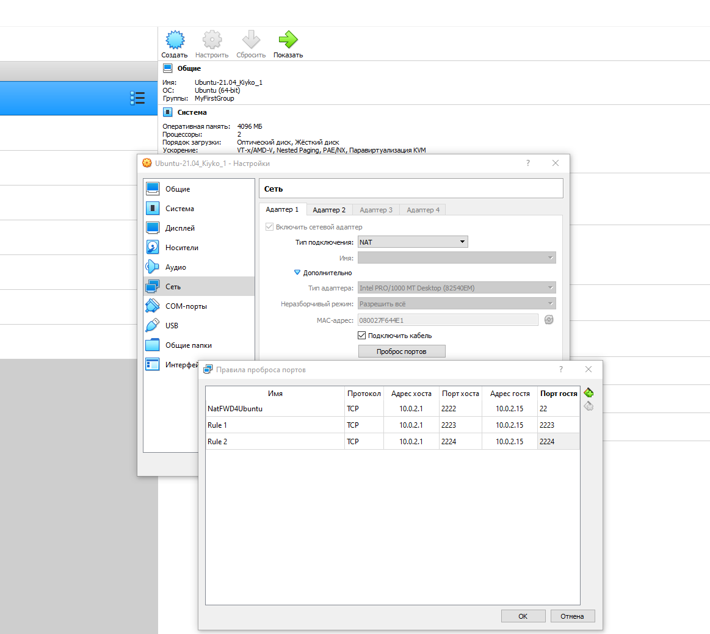
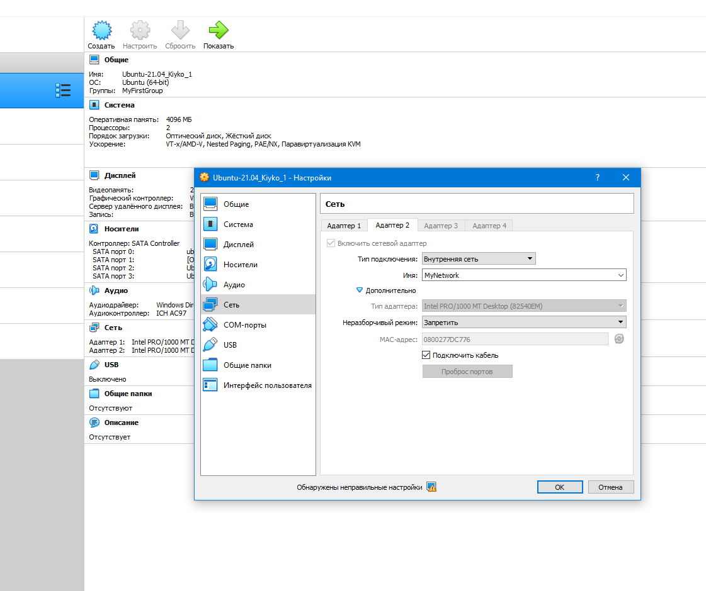
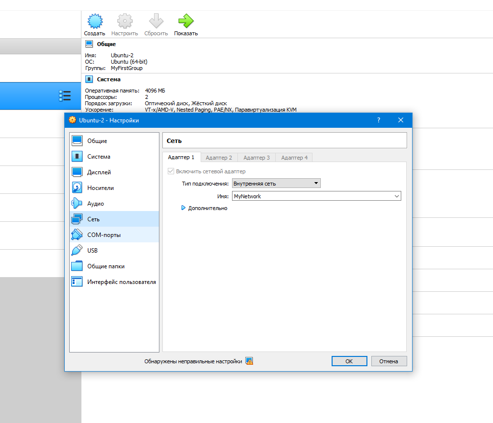
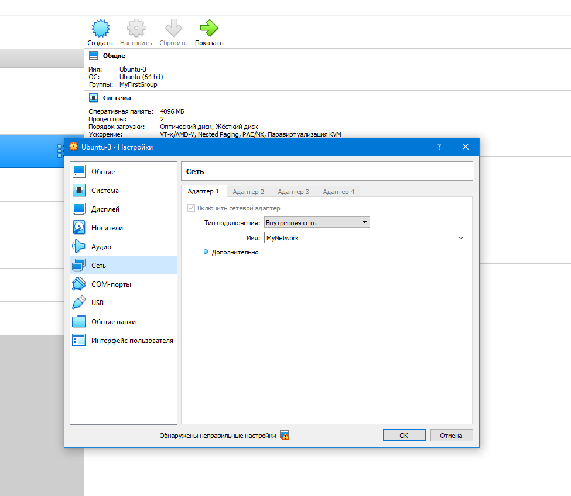


## 2) We well use DNSMASQ  as DHCP server on VM1:

### 2.1. Install DNSMASQ
```
sudo apt install dnsmasq  -y
```

### 2.2. Configure DNSMASQ
#### Let's add some configs to file /etc/dnsmasq.conf:
```
sudo vim /etc/dnsmasq.conf

___________________________________
#  group from who started server
user=nobody
group=nobody

# DHCP interface of my server
interface=enp0s8

# ip leasing pool
dhcp-range=192.168.1.10,192.168.1.50,24H

# let's assign MAC with a hosts
dhcp-host=08:00:27:CA:F4:4B,VM2,192.168.1.10
dhcp-host=08:00:27:2B:D9:58,VM3,192.168.1.20

# default gateway
dhcp-option=option:router,192.168.1.1

# DNS server
dhcp-option=option:dns-server,192.168.1.1

# ip leasing file
dhcp-leasefile=/var/lib/dnsmasq/dnsmasq.leases

# working DHCP in authritative mode
dhcp-authoritative


# DNS-server settings:
# forwarding DNS
server=8.8.8.8
___________________________________
```
#### After let's  create directory, leases-file and stop service  who may be conflict with DNSMASQ and start it:
```
sudo mkdir /var/lib/dnsmasq
sudo touch /var/lib/dnsmasq/dnsmasq.leases
sudo systemctl disable systemd-resolved
sudo systemctl mask systemd-resolved
sudo systemctl stop systemd-resolved

sudo systemctl start dnsmasq
sudo systemctl status dnsmasq
```

#### Also let's to  add  iptables rule to forward SSH from host to VM3:
```
sudo iptables -t nat -A PREROUTING -i enp0s3 -p tcp --dport 2224 -j DNAT --to-destination 192.168.1.20:22
```

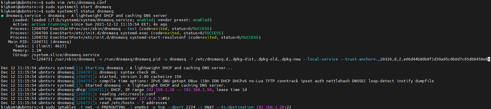

## 3) On VM2  and VM3 configured NETPLAN for getting IP-addresses from DHCP:

```
sudo vim /etc/netplan/01-network-manager-all.yaml

___________________________________

network:
  version: 2
  ethernets:
    enp0s3:
      dhcp4: true
      dhcp6: no
___________________________________
```

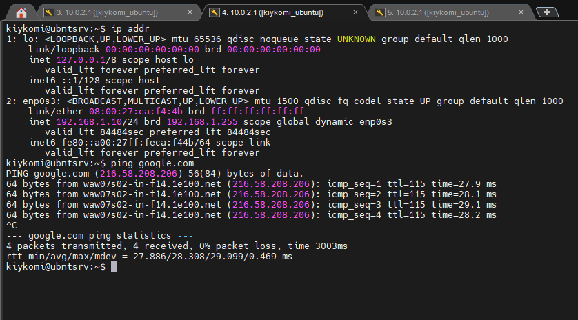
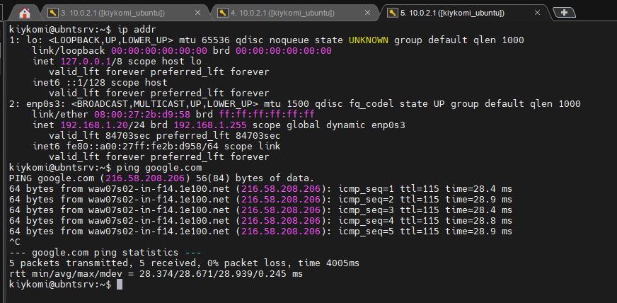


## 4) With installing of DBSMASQ we already have configured DNS server. Let's add A-records for VM's to file /etc/dnsmasq.conf

```
# DNS-server settings:
# forwarding DNS
#server=8.8.8.8
port=53
listen-address=192.168.1.1
no-hosts
domain=kiykomi.local
address=/VM1/192.168.1.1
address=/VM2/192.168.1.10
address=/VM3/192.168.1.20

```


## 5) Let's check it:

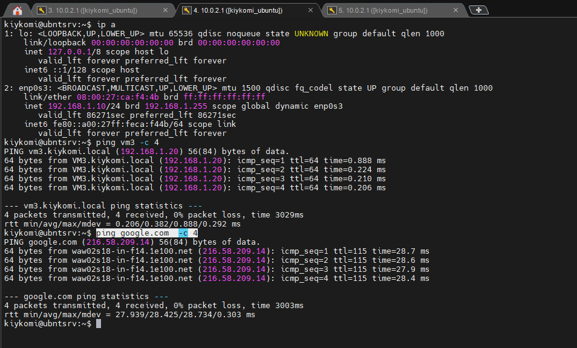
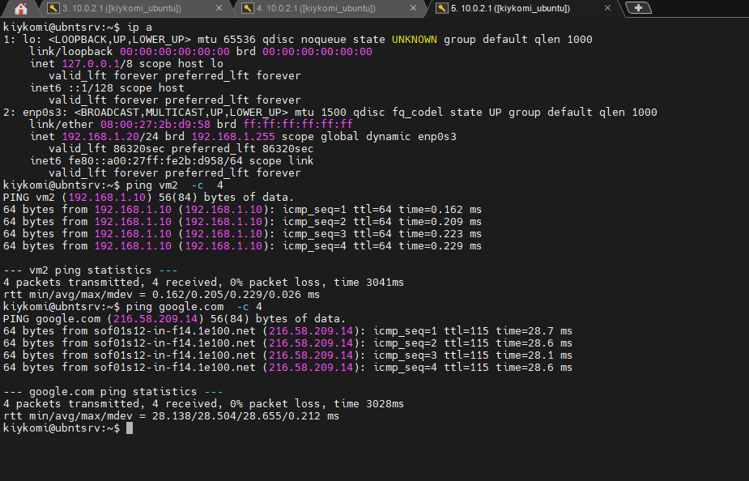


## 6) For next task I create this network structure:

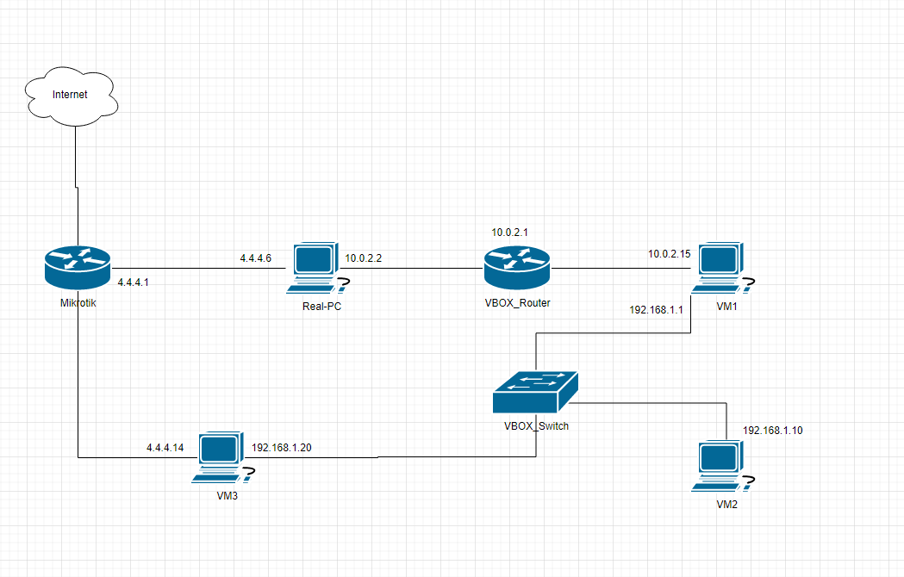

### After it I have install and configure Quagga on VMs:

#### VM1:

Installing Quagga
```
sudo apt install quagga -y
```

Creating Zebra.conf
```
sudo touch /etc/quagga/zebra.conf
sudo vi /etc/quagga/zebra.conf
```

Writing parameters in Zebra.conf
```
hostname VM1
password 123456Ss!
enable password 123456Ss!
log file /var/log/quagga/zebra.log
!
line vty
!
```

Creating Ospfd.conf
```
sudo touch /etc/quagga/ospfd.conf
sudo vi /etc/quagga/ospfd.conf
```

Writing parameters in Ospfd.conf
```
log file /var/log/quagga/ospfd.log
router ospf
 ospf router-id 192.168.1.1
 log-adjacency-changes
 redistribute kernel
 redistribute connected
 redistribute static
 network 192.168.1.0/24 area 1
!
access-list 20 permit 192.168.1.0 0.0.0.255
access-list 20 deny any
!
line vty
!
```

Changing rights for quagga and making log file
```
sudo chown quagga:quagga /etc/quagga/*.conf
sudo mkdir /var/log/quagga/
sudo chown quagga:quagga /var/log/quagga/
```

Checking  and starting Quagga service
```
sudo service zebra status
sudo service zebra restart
sudo service ospfd status
sudo service ospfd restart
```

#### VM2:

Installing Quagga
```
sudo apt install quagga -y
```

Creating Zebra.conf
```
sudo touch /etc/quagga/zebra.conf
sudo vi /etc/quagga/zebra.conf
```

Writing parameters in Zebra.conf
```
hostname VM2
password 123456Ss!
enable password 123456Ss!
log file /var/log/quagga/zebra.log
!
line vty
!
```

Creating Ospfd.conf
```
sudo touch /etc/quagga/ospfd.conf
sudo vi /etc/quagga/ospfd.conf
```

Writing parameters in Ospfd.conf
```
log file /var/log/quagga/ospfd.log
router ospf
 ospf router-id 192.168.1.10
 log-adjacency-changes
 redistribute kernel
 redistribute connected
 redistribute static
 network 192.168.1.0/24 area 1
!
access-list 20 permit 192.168.1.0 0.0.0.255
access-list 20 deny any
!
line vty
!
```

Changing rights for quagga and making log file
```
sudo chown quagga:quagga /etc/quagga/*.conf
sudo mkdir /var/log/quagga/
sudo chown quagga:quagga /var/log/quagga/
```

Checking  and starting Quagga service
```
sudo service zebra status
sudo service zebra restart
sudo service ospfd status
sudo service ospfd restart
```


#### VM3:

Installing Quagga
```
sudo apt install quagga -y
```

Creating Zebra.conf
```
sudo touch /etc/quagga/zebra.conf
sudo vi /etc/quagga/zebra.conf
```

Writing parameters in Zebra.conf
```
hostname VM3
password 123456Ss!
enable password 123456Ss!
log file /var/log/quagga/zebra.log
!
line vty
!
```

Creating Ospfd.conf
```
sudo touch /etc/quagga/ospfd.conf
sudo vi /etc/quagga/ospfd.conf
```

Writing parameters in Ospfd.conf
```
log file /var/log/quagga/ospfd.log
router ospf
 ospf router-id 192.168.1.20
 log-adjacency-changes
 redistribute kernel
 redistribute connected
 redistribute static
 network 192.168.1.0/24 area 1
 network 4.4.4.0/24 area 0.0.0.0
!
access-list 20 permit 192.168.1.0 0.0.0.255
access-list 20 permit 4.4.4.0 0.0.0.255
access-list 20 deny any
!
line vty
!
```

Changing rights for quagga and making log file
```
sudo chown quagga:quagga /etc/quagga/*.conf
sudo mkdir /var/log/quagga/
sudo chown quagga:quagga /var/log/quagga/
```

Checking  and starting Quagga service
```
sudo service zebra status
sudo service zebra restart
sudo service ospfd status
sudo service ospfd restart
```


### Let's check how it works with routing:


 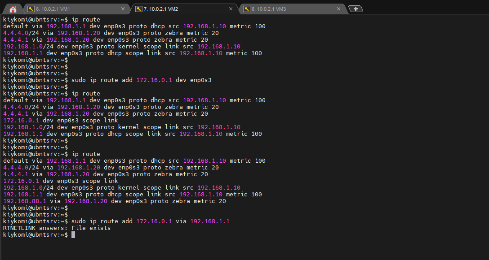

 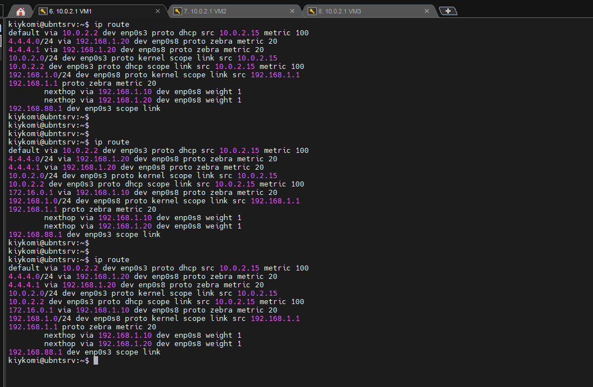

 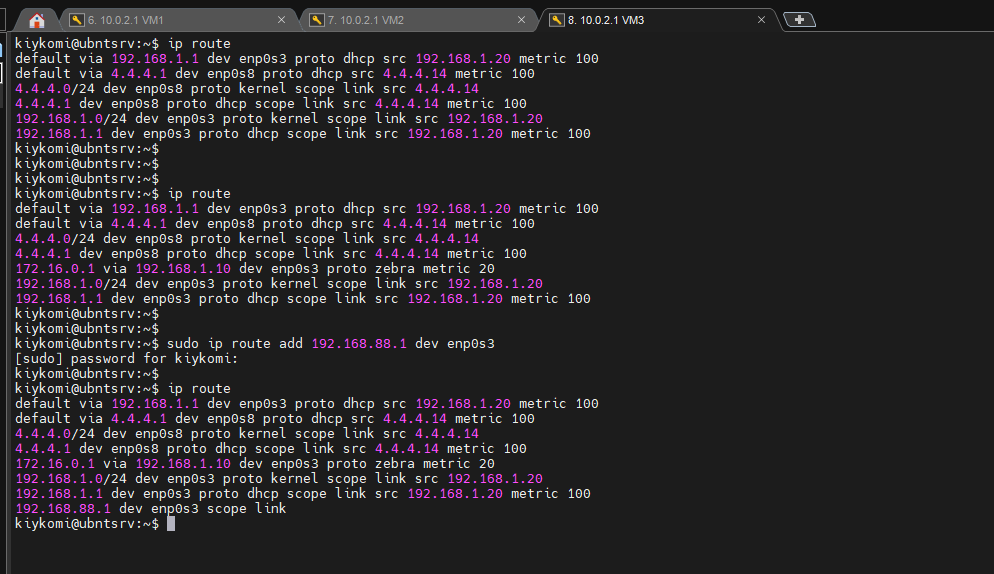


 # Used information sources:

[Configuring DHCP and DNS  with DNSMASQ](https://mnorin.com/nastrojka-dnsmasq-dhcp-dns.html)

[Installing and configuring DNSMASQ](https://linux-admins.ru/article.php?id_article=62&article_title=%D0%A3%D1%81%D1%82%D0%B0%D0%BD%D0%BE%D0%B2%D0%BA%D0%B0%20%D0%B8%20%D0%BD%D0%B0%D1%81%D1%82%D1%80%D0%BE%D0%B9%D0%BA%D0%B0%20Dnsmasq)

[How to install  and configure DNSMASQ  in Ubuntu](https://infoit.com.ua/linux/ubuntu/kak-ustanovit-i-nastroit-dnsmasq-na-ubuntu-18-04-lts/)

[Problems with DNSMASQ](https://askubuntu.com/questions/191226/dnsmasq-failed-to-create-listening-socket-for-port-53-address-already-in-use)

[Configuring OSPF in QUAGGA](https://ixnfo.com/nastrojka-ospf-v-quagga.html)

[Dynamic routing in Linux](https://poligon218.ru/2020/01/23/%D0%B4%D0%B8%D0%BD%D0%B0%D0%BC%D0%B8%D1%87%D0%B5%D1%81%D0%BA%D0%B0%D1%8F-%D0%BC%D0%B0%D1%80%D1%88%D1%80%D1%83%D1%82%D0%B8%D0%B7%D0%B0%D1%86%D0%B8%D1%8F-%D0%B2-linux/)

Mikhail Kiyko