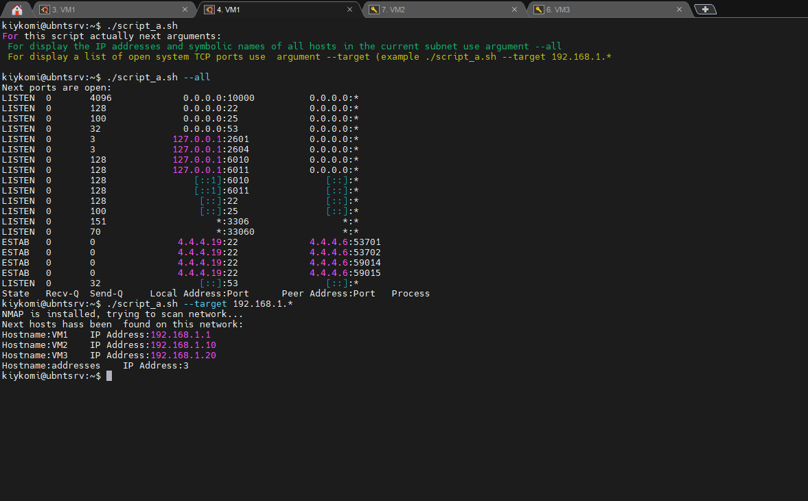
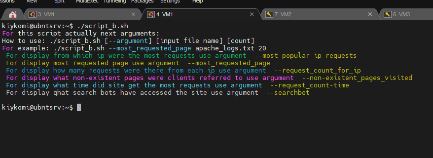
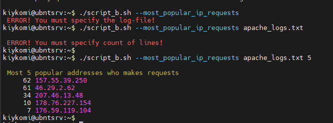
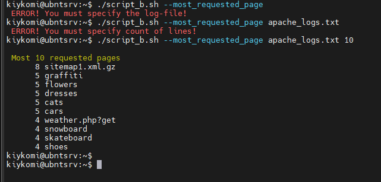
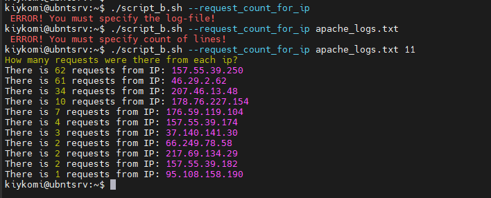
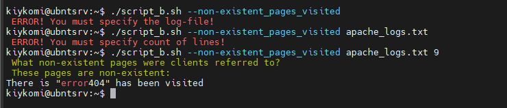
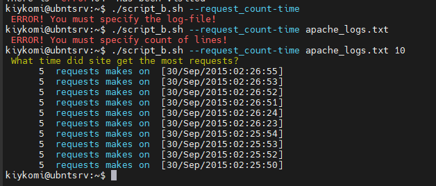
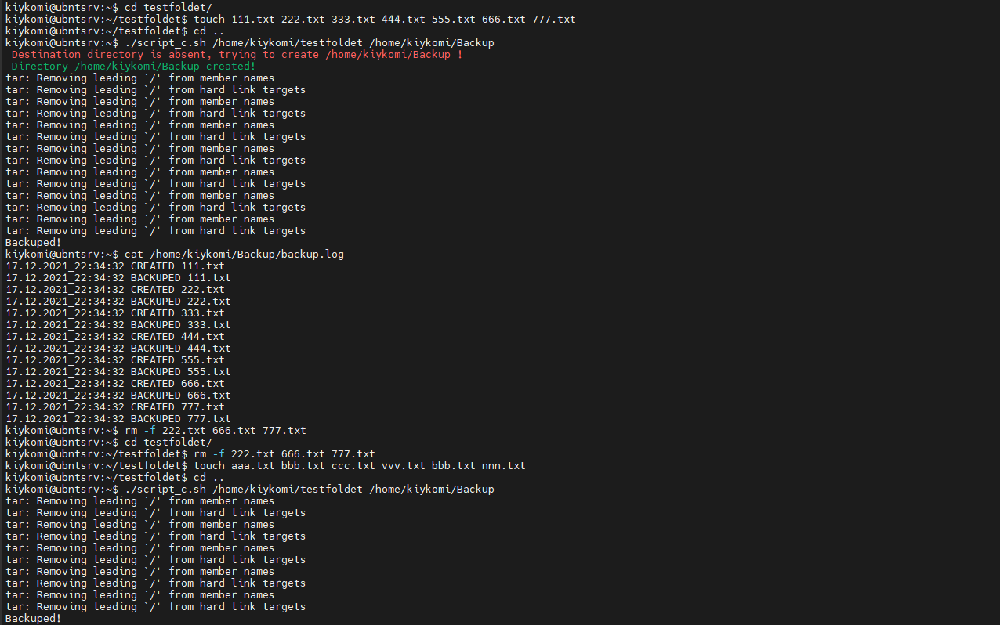
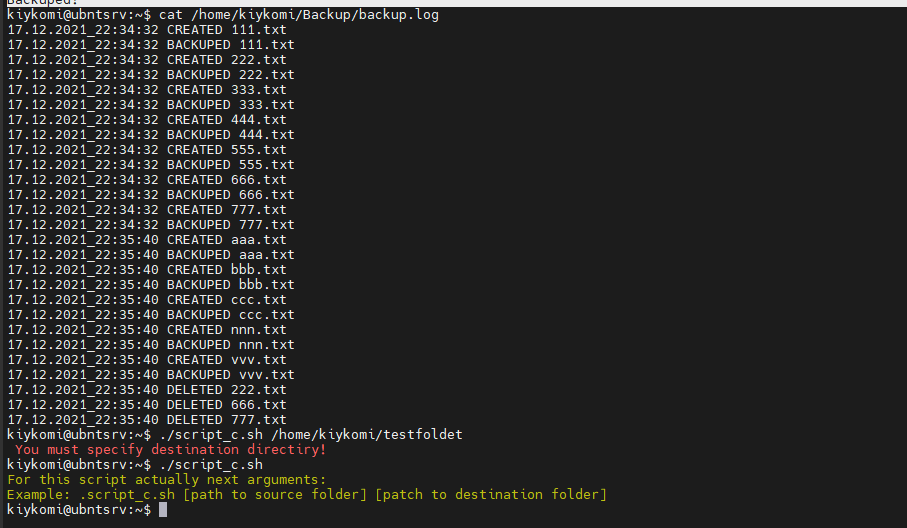

# Task 7.1

## Part A.

### I make a script to scan host open ports and explore ip addresses and hostnames of network devices:

```
#!/bin/bash


#This function lists TCP opened TCP ports on host
function portscan
{
        echo "Next ports are open:"
        ss -ant | sort -k 4
}

# This function shows existing ip addresses and names in asked network
function netscan {
        # Checking what NMAP  is installed
        test -e /usr/bin/nmap
        if [[ "$?" == "0" ]]
        then
                echo "NMAP is installed, trying to scan network..."
        else
                echo "NMAP isn't installed, trying to install NMAP..."
                sudo apt install nmap  -y
        fi

# Perform scanning network with NMAP
        addr=$1
        echo "Next hosts hass been  found on this network:"
        nmap -sP $addr | awk 'NR % 2 == 0 {print "Hostname:" $5 "    " "IP Address:" $6}' | sed  's/(//g; s/)//g'
}

# This condition for written for display a list of possible keys and their description.
if [[ "$#" == "0" ]]
then
        echo "For this script actually next arguments:"
        echo -e "\033[32m For display the IP addresses and symbolic names of all hosts in the current subnet use argument --all"
        echo -e "\033[33m For display a list of open system TCP ports use  argument --target (example ./script_a.sh --target 192.168.1.*"
        echo -e "\033[0m"
        exit 0
fi


# Block  of script where is checking conditions of input parameter.
if [ "$1" == "--all" ]
then
        portscan

elif [ "$1" == "--target" ]
then
        netscan $2
fi
```

### This is result of my script:




## Part B.

### So, let's see to body of our script:

```
#!/bin/bash


#This displays which ip were the most requests
function mpir
{
        if [[ -z "$1" ]]
        then
                echo -e "\033[31m ERROR! You must specify the log-file! \033[0m"
                exit  0
        elif [[ -z "$2" ]]
        then
                echo -e "\033[31m ERROR! You must specify count of lines! \033[0m"
                exit 0
        fi
        logname=$1
        echo -e "\033[33m Most $2 popular addresses who makes requests \033[0m"
        cat $logname | grep -E -o '([0-9]{1,3}[\.]){3}[0-9]{1,3}' | sort | uniq -c | sort -gr | head -n $2

}

#This displays what is the most requested page
function mrp
{
        if [[ -z "$1" ]]
        then
                echo -e "\033[31m ERROR! You must specify the log-file! \033[0m"
                exit  0
        elif [[ -z "$2" ]]
        then
                echo -e "\033[31m ERROR! You must specify count of lines! \033[0m"
                exit 0
        fi
        logname=$1
        echo -e "\033[33m Most $2 requested pages \033[0m"
        cat $logname | awk '{print $7}' | sort | uniq -c | sort -gr | head -n $2 | sed 's/\///g'        
}

#This displays how many requests were there from each ip
function ripc
{
        if [[ -z "$1" ]]
        then
                echo -e "\033[31m ERROR! You must specify the log-file! \033[0m"
                exit  0
        elif [[ -z "$2" ]]
        then
                echo -e "\033[31m ERROR! You must specify count of lines! \033[0m"
                exit 0
        fi
        logname=$1
        echo -e "\033[33mHow many requests were there from each ip? \033[0m"
        cat $logname | grep -E -o "([0-9]{1,3}[\.]){3}[0-9]{1,3}" | sort | uniq -c | sort -gr | awk '{print "There is " "\033[33m" $1 "\033[0m" " requests from IP: " $2}' | head -n $2
}

#This displays what non-existent pages were clients referred to
function err404
{
        if [[ -z "$1" ]]
        then
                echo -e "\033[31m ERROR! You must specify the log-file! \033[0m"
                exit  0
        elif [[ -z "$2" ]]
        then
                echo -e "\033[31m ERROR! You must specify count of lines! \033[0m"
                exit 0
        fi
        echo -e "\033[33m What non-existent pages were clients referred to? \033[0m"
        echo -e "\033[33m These pages are non-existent: \033[0m"
        logname=$1
        grep "404 " $logname | awk '{print "There is \"" $7 "\" has been visited"}' | uniq | sed 's/\///g' | head -n $2
}

#This displays what time did site get the most requests
function reqcount
{
        if [[ -z "$1" ]]
        then
                echo -e "\033[31m ERROR! You must specify the log-file! \033[0m"
                exit  0
        elif [[ -z "$2" ]]
        then
                echo -e "\033[31m ERROR! You must specify count of lines! \033[0m"
                exit 0
        fi
        echo -e "\033[33m What time did site get the most requests? \033[0m"
        logname=$1
        cat $logname | awk '{print  "\033[36m requests makes on \033[0m " $4"]"}' | sort | uniq -c | sort -gr | head -n $2
}

#This displays what search bots have accessed the site? (UA + IP)
function searchbot
{
        if [[ -z "$1" ]]
        then
                echo -e "\033[31m ERROR! You must specify the log-file! \033[0m"
                exit  0
        elif [[ -z "$2" ]]
        then
                echo -e "\033[31m ERROR! You must specify count of lines! \033[0m"
                exit 0
        fi
        echo -e "\033[33m What search bots have accessed the site? (UA + IP)\033[0m"
        logname=$1
        grep "bot"  $logname | awk -F\" '{print $6}' | sort | uniq -c | head -n $2
}


# This condition for written for display a list of possible keys and their description.
if [[ "$#" == "0" ]]
then
	echo -e "\033[31m Warninng! Script started without arguments! \033[0m"
        echo "For this script actually next arguments:"
        echo "How to use: ./script_b.sh [--argument] [input file name] [count]"
        echo "For example: ./script_b.sh --most_requested_page apache_logs.txt 20"
        echo -e "\033[32m For display from which ip were the most requests use argument \033[33m --most_popular_ip_requests"
        echo -e "\033[33m For display most requested page use argument \033[33m --most_requested_page"
        echo -e "\033[34m For display how many requests were there from each ip use argument \033[33m --request_count_for_ip"
        echo -e "\033[35m For display what non-existent pages were clients referred to use argument \033[33m --non-existent_pages_visited"
        echo -e "\033[36m For display what time did site get the most requests use argument \033[33m --request_count-time"
        echo -e "\033[37m For display qhat search bots have accessed the site use argument \033[33m --searchbot"
        echo -e "\033[0m"
        exit 0
fi


# Block  of script where is checking conditions of input parameter.
if [ "$1" == "--most_popular_ip_requests" ]
then
        mpir $2 $3

elif [ "$1" == "--most_requested_page" ]
then
        mrp $2 $3
elif [ "$1" == "--request_count_for_ip" ]
then
        ripc $2 $3
elif [ "$1" == "--non-existent_pages_visited" ]
then
        err404 $2 $3
elif [ "$1" == "--request_count-time" ]
then
        reqcount $2 $3
elif [ "$1" == "--searchbot" ]
then
        searchbot $2 $3
fi
```


###  And let's see how it works on screenshots:

Result of script without arguments:


Result of script with argument --most_popular_ip_requests:


Result of script with argument --most_requested_page:


Result of script with argument --request_count_for_ip:


Result of script with argument --non-existent_pages_visited:


Result of script with argument --request_count-time: 



Result of script with argument --searchbot:


## Part C.

### Code:

```
##!/bin/bash

# This condition for written for display a list of possible keys and their description.
if [[ "$#" == "0" ]]
then
        echo -e "\033[33mFor this script actually next arguments:"
		echo -e "Example: .script_c.sh [path to source folder] [patch to destination folder] \033[0m"        
        exit 0
elif ! [[ -d $1 ]]
then
    	echo -e "\033[31m Error! Source directory not exists!\033[0m"
	exit 0
elif [[ -z $2 ]]
then
	echo -e "\033[31m You must specify destination directiry!\033[0m"
	exit 0
elif ! [[ -d $2 ]]
then
    	echo -e "\033[31m Destination directory is absent, trying to create $2 !\033[0m"
	mkdir "$2" 
	echo -e "\033[32m Directory $2 created!\033[0m"
fi

# Set parameters
srcdir=$1
dstdir=$2
log=$dstdir/backup.log
tmpdir=$dstdir/tmp

if ! [[ -d $tmpdir ]]; then
       	mkdir $tmpdir
fi
touch $dstdir/backup.log
touch $tmpdir/ls.tmp;
touch $tmpdir/snapshot.tmp;


ls $srcdir > $tmpdir/ls.tmp;

# Archiving and logging
dt=$(date '+%d.%m.%Y_%H:%M:%S');
for var1 in $(diff -y --suppress-common-lines $tmpdir/ls.tmp $tmpdir/snapshot.tmp | awk '{print $1}' | sed 's/>//g; /^[[:space:]]*$/d')
do
        echo "$dt CREATED $var1" >> $log
        tar -rvf $dstdir/Backup.tar $srcdir/$var1 > /dev/null 
        echo "$dt BACKUPED $var1" >> $log
done

echo "Backuped!"

for var2 in $(diff -y --suppress-common-lines $tmpdir/ls.tmp $tmpdir/snapshot.tmp | awk '{print $2 $3}' | sed 's/<//g; /^[[:space:]]*$/d; s/|//g')
do
        echo "$dt DELETED $var2" >> $log
done

rm -rf $tmpdir/ls.tmp;
ls $srcdir > $tmpdir/snapshot.tmp
```


### Result:







# Used information sources:

### 1) [How to change several patterns in the SED command](https://coderoad.ru/26568952/%D0%9A%D0%B0%D0%BA-%D0%B7%D0%B0%D0%BC%D0%B5%D0%BD%D0%B8%D1%82%D1%8C-%D1%81%D1%80%D0%B0%D0%B7%D1%83-%D0%BD%D0%B5%D1%81%D0%BA%D0%BE%D0%BB%D1%8C%D0%BA%D0%BE-%D0%BF%D0%B0%D1%82%D1%82%D0%B5%D1%80%D0%BD%D0%BE%D0%B2-%D0%BD%D0%B0-sed)

### 2) [SED LINUX COMMAND](https://losst.ru/komanda-sed-linux)

### 3) [How do I get a list of all valid IP addresses on my local network](https://coderoad.ru/13669585/%D0%9A%D0%B0%D0%BA-%D0%BF%D0%BE%D0%BB%D1%83%D1%87%D0%B8%D1%82%D1%8C-%D1%81%D0%BF%D0%B8%D1%81%D0%BE%D0%BA-%D0%B2%D1%81%D0%B5%D1%85-%D0%B4%D0%BE%D0%BF%D1%83%D1%81%D1%82%D0%B8%D0%BC%D1%8B%D1%85-%D0%B0%D0%B4%D1%80%D0%B5%D1%81%D0%BE%D0%B2-IP-%D0%B2-%D0%BB%D0%BE%D0%BA%D0%B0%D0%BB%D1%8C%D0%BD%D0%BE%D0%B9-%D1%81%D0%B5%D1%82%D0%B8)

### 4) [View computers on a local network from Linux terminal](https://ru.stackoverflow.com/questions/541699/%D0%9F%D1%80%D0%BE%D1%81%D0%BC%D0%BE%D1%82%D1%80-%D0%BA%D0%BE%D0%BC%D0%BF%D1%8C%D1%8E%D1%82%D0%B5%D1%80%D0%BE%D0%B2-%D0%B2-%D0%BB%D0%BE%D0%BA%D0%B0%D0%BB%D1%8C%D0%BD%D0%BE%D0%B9-%D1%81%D0%B5%D1%82%D0%B8-%D0%B8%D0%B7-%D1%82%D0%B5%D1%80%D0%BC%D0%B8%D0%BD%D0%B0%D0%BB%D0%B0-linux)

### 5) [Colored text output with echo command in Bash](https://mb4.ru/programming/bash/1254-color-output-echo.html)

### 6) [How to see  open ports in  Linux](https://losst.ru/kak-posmotret-otkrytye-porty-v-linux)

### 7) [Sort command in Linux](https://losst.ru/komanda-sort-v-linux)

### 8) [Full manual for Bash-scripting for novices](https://habr.com/ru/company/ruvds/blog/325522/)

### 9) [One-liners for parsing Apache log files](https://blog.debian-help.ru/2015/01/odnostrochniki-dlya-analiza-log-failov-apache)

### 10) [awk and grep to parse apache logs](https://qastack.ru/server/11028/do-you-have-any-useful-awk-and-grep-scripts-for-parsing-apache-logs)

### 11) [web server HTTP response status](https://vds-admin.ru/http/kody-sostoyaniya-http-otveta-veb-servera-metody-http)

### 12) [HTTP response codes](https://developer.mozilla.org/ru/docs/Web/HTTP/Status)

### 13) [Word processing commands](https://www.opennet.ru/docs/RUS/bash_scripting_guide/x7050.html)

### 14) [How to determine if bash variable is empty](https://qastack.ru/server/7503/how-to-determine-if-a-bash-variable-is-empty)

### 15) [Archiving in Linux](https://losst.ru/arhivatsiya-v-linux)

### 16) [DIFF command](https://losst.ru/sravnenie-fajlov-v-linux)

### 17) [linux-diff-command-options](http://rus-linux.net/MyLDP/consol/linux-diff-command-options.html)

### 18) [bash_scripting_guide](https://www.opennet.ru/docs/RUS/bash_scripting_guide/x2565.html)


